# Baza podataka za moju aplikaciju za dopisivanje

## Razlog za projekat

Pre otprilike nekih mesec dana sam završio projekat iz  
Objektno Orijentisanog Programiranja, aplikaciju za dopisivanje  
na bilo kojoj lokalnoj mrezi za računare sa windows sistemima u C#.  
(Ako ste zainteresovani možete naći dokumentaciju na [PeerSpeakV1 pdf](https://github.com/kripticni/Gim-IT-III-godina/blob/main/Objektno%20Orijentisano/Projekti/PeerSpeak-kripticni/docs/PeerSpeak.pdf)  
i kod za aplikaciju na [PeerSpeakV1 Izvorni Kod](https://github.com/kripticni/Gim-IT-III-godina/tree/main/Objektno%20Orijentisano/Projekti/PeerSpeak-kripticni/PeerSpeak))  
Nedavno sam odlucio da ću da proširim ovaj projekat sa C++ tako što ću mu  
dodati podršku za sve često korišćene operativne sisteme (Linux, Android, MacOS, IOS)  
da bi bio više pristupačniji, i takodje ću dodati podršku za dopisivanje medju  
javnih mreža kako bi imao veću primenu.  

Jedan od problema koje ova aplikacija ima je što se svi podaci za  
korisnike pronadjene na mreži čuvaju u RAM memoriji i brišu  
nakon svakog izlaska iz programa. Što možda i jeste mali problem  
za jednu lokalnu mrežu ali kada se projekat proširi na sve javne mreže  
proširiće se i problem koji je pred nama.  

Da bi smo ovaj problem rešili, napravićemo bazu podataka za lokalan server  
koji će čuvati na disku sve ostale korisnike (i servere) koje on pronadje  
pa kada se jedan lokalan korisnik poveže na njega, on će mu uruciti kopiju.  
Nakon što korisnik dobije kopiju, njegov program će sam vršiti upite nad njom  
kako bi našao ostale korisnike bez pretraživanja.  

Napraviću dve baze podataka, jednu za Oracle Apex (školu) a druga će biti  
na sqlite koja će se zapravo koristiti.  
Za projekat sam odabrao sqlite zato što je mnogo lakši (brži) u odnosu na apex,  
zato što ga korisnici mogu pokrenuti na svojoj mašini, i zato što postoji biblioteka  
za interfejsovanje sa C++ (SQLite3 i SQLiteCpp).  

## Logički model

Svaki server se nalazi na jednoj mreži (javnoj adresi), i svaka javna adresa ima jedan server,
svaka mreža ima više podmreža, a na svakoj podmreži se nalaze više povezanih korisnika.  
Svaki korisnik ima svoje podatke i hashove koje su nam dali kada su se registrovali na server.  
Takodje kada korisnik više nije povezan na server, on se briše iz tabele korisnici, ali se njegovi
podaci kao i hashovi za logovanje na server čuvaju.


## Kreiranje tabela

Kako bi se osigurala kompatibilnost izmedju i SQLite, koristićemo INT umesto NUMBER za celobrojne vrednosti,
i VARCHAR umesto VARCHAR2 za tekstualne podatke, budući da su ovi tipovi podataka podržani u oba sistema.  
Takodje ću koristiti komandu/ključnu reč CHECK kako bih proverio unos
u tabele.  

```sql
CREATE TABLE mreze(
    javna_addr INT PRIMARY KEY CHECK(javna_addr BETWEEN 0 AND 4294967295)
);
```
Osigurano da je javna adresa validan 32-bitna integer bez znaka.  
    

```SQL
CREATE TABLE serveri(
    javna_addr INT PRIMARY KEY CHECK(javna_addr BETWEEN 0 AND 4294967295),
    naziv VARCHAR(50) UNIQUE NOT NULL CHECK(LENGTH(naziv) BETWEEN 3 AND 50),
    port INT NOT NULL CHECK(port BETWEEN 0 AND 65535),
    FOREIGN KEY(javna_addr) REFERENCES mreze(javna_addr)
);
```
Osigurali smo da unos mora biti:  
- Validna javna adresa (bilo koji 32 bitni integer bez znaka)  
- Naziv servera izmedju 3 i 50 karaktera  
- Validan port (bilo koji 16 bitni integer bez znaka)

```sql
CREATE TABLE podmreze(
    javna_addr INT CHECK(javna_addr BETWEEN 0 AND 4294967295), 
    addr_mreze INT CHECK(addr_mreze BETWEEN 0 AND 4294967295),
    broadcast_addr INT NOT NULL CHECK(broadcast_addr BETWEEN 0 AND 4294967295),
    gateway_addr INT NOT NULL CHECK(gateway_addr BETWEEN 0 AND 4294967295),
    FOREIGN KEY(javna_addr) REFERENCES mreze(javna_addr),
    PRIMARY KEY(javna_addr, addr_mreze)
);
```

```sql
CREATE TABLE korisnici(
    korisnicko_ime VARCHAR(20) PRIMARY KEY CHECK(LENGTH(korisnicko_ime) BETWEEN 3 AND 20),
    javna_addr INT NOT NULL CHECK(javna_addr BETWEEN 0 AND 4294967295),
    addr_mreze INT NOT NULL CHECK(addr_mreze BETWEEN 0 AND 4294967295),
    privatna_addr INT NOT NULL CHECK(privatna_addr BETWEEN 0 AND 4294967295),
    port INT NOT NULL CHECK(port BETWEEN 0 AND 65535),
    FOREIGN KEY(javna_addr, addr_mreze) REFERENCES podmreze(javna_addr, addr_mreze),
    FOREIGN KEY(korisnicko_ime) REFERENCES korisnici_podaci(korisnicko_ime)
);

```sql
CREATE TABLE korisnici_podaci(
    korisnicko_ime VARCHAR(20) PRIMARY KEY CHECK(LENGTH(korisnicko_ime) BETWEEN 3 AND 20),
    email VARCHAR(50) NOT NULL CHECK(email LIKE '%@%' AND LENGTH(email) BETWEEN 3 AND 50),
    broj_telefona VARCHAR(15) NOT NULL,
    profilna BLOB NOT NULL,
    -- hteo bih proveru za broj telefona i profilnu (manje od 2mb)
    -- ali ne postoji nacin koji radi i za sqlite i za oracle apex
    ime VARCHAR(50) NOT NULL CHECK(LENGTH(ime) BETWEEN 1 and 50),
    prezime VARCHAR(50) NOT NULL CHECK(LENGTH(prezime) BETWEEN 1 and 50),
    datum_rodjenja DATE NOT NULL,
    pol VARCHAR(1) NOT NULL CHECK(pol = 'm' OR pol = 'z' OR pol = 'n')
);
```

```sql
CREATE TABLE korisnici_verifikacije(
    korisnicko_ime VARCHAR(20) PRIMARY KEY CHECK(LENGTH(korisnicko_ime) BETWEEN 3 AND 20),
    hash_sifre VARCHAR(512) NOT NULL,
    hash_profila VARCHAR(512) NOT NULL,
    pgp_javni_kljuc BLOB NOT NULL,
    -- hteo bih i ovde proveru ali ponovo je postoji nacin
    FOREIGN KEY(korisnicko_ime) REFERENCES korisnici_podaci(korisnicko_ime)
);
```

Komande:


## Unos podataka u tabele

Nakon što smo oformili tabele, unećemo i validne podatke u njih. (5 redova)
Ovde sam koristio HEXTORAW za oracle apex da bih preveo string u binaran objekat,  
dok se u sqlite samo stavi X ispred stringa koji koristimo.  

```sql
-- prvi red
INSERT INTO mreze (javna_addr) VALUES (1234567890);

INSERT INTO podmreze (javna_addr, addr_mreze, broadcast_addr, gateway_addr) 
VALUES (1234567890, 100, 1234567999, 1234567891);

INSERT INTO korisnici_podaci (korisnicko_ime, email, broj_telefona, profilna, ime, prezime, datum_rodjenja, pol) 
VALUES ('korisnik1', 'korisnik@example.com', '0641234567', HEXTORAW('89504E470D0A1A0A0000000D49484452'), 'Marko', 'Markovic', TO_DATE('1990-05-15', 'YYYY-MM-DD'), 'm');

INSERT INTO korisnici_verifikacije (korisnicko_ime, hash_sifre, hash_profila, pgp_javni_kljuc) 
VALUES ('korisnik1', 'abc123hashsifre', 'def456hashprofila', HEXTORAW('1234567890ABCDEF'));

INSERT INTO korisnici (korisnicko_ime, javna_addr, addr_mreze, privatna_addr, port) 
VALUES ('korisnik1', 1234567890, 100, 19216811, 5000);

INSERT INTO serveri (javna_addr, naziv, port) 
VALUES (1234567890, 'MojServer', 8080);
```

```sql
-- ostala 4 reda
INSERT INTO mreze (javna_addr) VALUES (1234567891);
INSERT INTO mreze (javna_addr) VALUES (1234567892);
INSERT INTO mreze (javna_addr) VALUES (1234567893);
INSERT INTO mreze (javna_addr) VALUES (1234567894);

INSERT INTO podmreze (javna_addr, addr_mreze, broadcast_addr, gateway_addr)
VALUES (1234567891, 101, 1234567999, 1234567892);

INSERT INTO podmreze (javna_addr, addr_mreze, broadcast_addr, gateway_addr)
VALUES (1234567892, 102, 1234567998, 1234567893);

INSERT INTO podmreze (javna_addr, addr_mreze, broadcast_addr, gateway_addr)
VALUES (1234567893, 103, 1234567997, 1234567894);

INSERT INTO podmreze (javna_addr, addr_mreze, broadcast_addr, gateway_addr)
VALUES (1234567894, 104, 1234567996, 1234567895);

INSERT INTO korisnici_podaci (korisnicko_ime, email, broj_telefona, profilna, ime, prezime, datum_rodjenja, pol)
VALUES ('korisnik2', 'korisnik2@example.com', '0641234568', HEXTORAW('89504E470D0A1A0A0000000D49484453'), 'Ana', 'Petrovic', TO_DATE('1992-07-21', 'YYYY-MM-DD'), 'z');

INSERT INTO korisnici_podaci (korisnicko_ime, email, broj_telefona, profilna, ime, prezime, datum_rodjenja, pol)
VALUES ('korisnik3', 'korisnik3@example.com', '0641234569', HEXTORAW('89504E470D0A1A0A0000000D49484454'), 'Ivan', 'Jovanovic', TO_DATE('1988-12-10', 'YYYY-MM-DD'), 'm');

INSERT INTO korisnici_podaci (korisnicko_ime, email, broj_telefona, profilna, ime, prezime, datum_rodjenja, pol)
VALUES ('korisnik4', 'korisnik4@example.com', '0641234570', HEXTORAW('89504E470D0A1A0A0000000D49484455'), 'Jelena', 'Nikolic', TO_DATE('1995-03-30', 'YYYY-MM-DD'), 'z');

INSERT INTO korisnici_podaci (korisnicko_ime, email, broj_telefona, profilna, ime, prezime, datum_rodjenja, pol)
VALUES ('korisnik5', 'korisnik5@example.com', '0641234571', HEXTORAW('89504E470D0A1A0A0000000D49484456'), 'Marko', 'Ilic', TO_DATE('1991-11-05', 'YYYY-MM-DD'), 'm');

INSERT INTO korisnici_verifikacije (korisnicko_ime, hash_sifre, hash_profila, pgp_javni_kljuc)
VALUES ('korisnik2', 'abc124hashsifre', 'def457hashprofila', HEXTORAW('1234567890ABCDE0'));

INSERT INTO korisnici_verifikacije (korisnicko_ime, hash_sifre, hash_profila, pgp_javni_kljuc)
VALUES ('korisnik3', 'abc125hashsifre', 'def458hashprofila', HEXTORAW('1234567890ABCDE1'));

INSERT INTO korisnici_verifikacije (korisnicko_ime, hash_sifre, hash_profila, pgp_javni_kljuc)
VALUES ('korisnik4', 'abc126hashsifre', 'def459hashprofila', HEXTORAW('1234567890ABCDE2'));

INSERT INTO korisnici_verifikacije (korisnicko_ime, hash_sifre, hash_profila, pgp_javni_kljuc)
VALUES ('korisnik5', 'abc127hashsifre', 'def460hashprofila', HEXTORAW('1234567890ABCDE3'));

INSERT INTO korisnici (korisnicko_ime, javna_addr, addr_mreze, privatna_addr, port)
VALUES ('korisnik2', 1234567891, 101, 19216812, 5001);

INSERT INTO korisnici (korisnicko_ime, javna_addr, addr_mreze, privatna_addr, port)
VALUES ('korisnik3', 1234567892, 102, 19216813, 5002);

INSERT INTO korisnici (korisnicko_ime, javna_addr, addr_mreze, privatna_addr, port)
VALUES ('korisnik4', 1234567893, 103, 19216814, 5003);

INSERT INTO korisnici (korisnicko_ime, javna_addr, addr_mreze, privatna_addr, port)
VALUES ('korisnik5', 1234567894, 104, 19216815, 5004);

INSERT INTO serveri (javna_addr, naziv, port)
VALUES (1234567891, 'Server2', 8081);

INSERT INTO serveri (javna_addr, naziv, port)
VALUES (1234567892, 'Server3', 8082);

INSERT INTO serveri (javna_addr, naziv, port)
VALUES (1234567893, 'Server4', 8083);

INSERT INTO serveri (javna_addr, naziv, port)
VALUES (1234567894, 'Server5', 8084)
```

Komande:

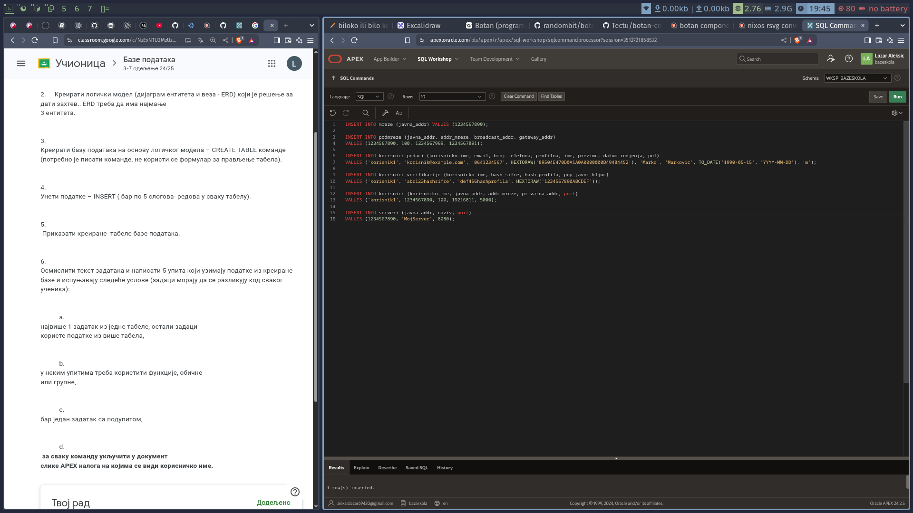
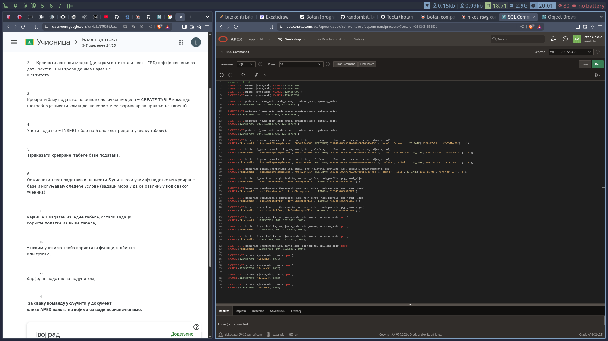

Prikaz tabela:

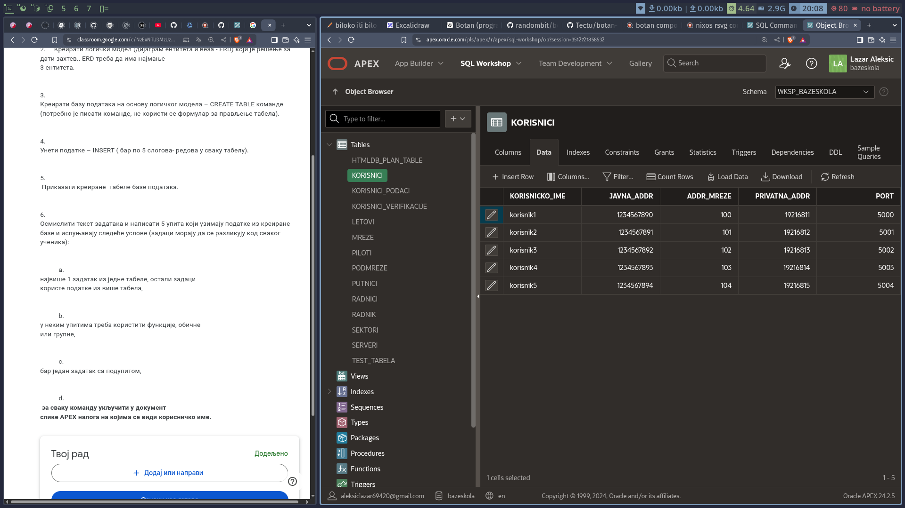
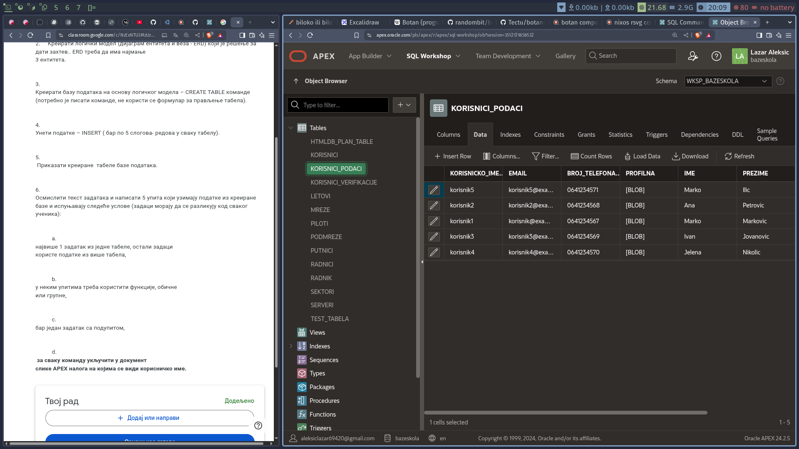
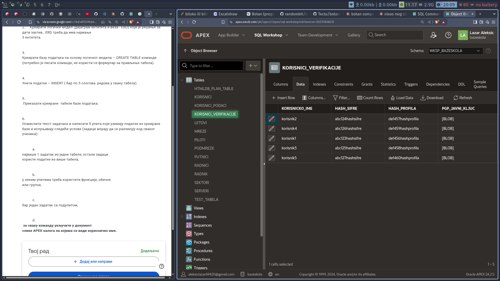
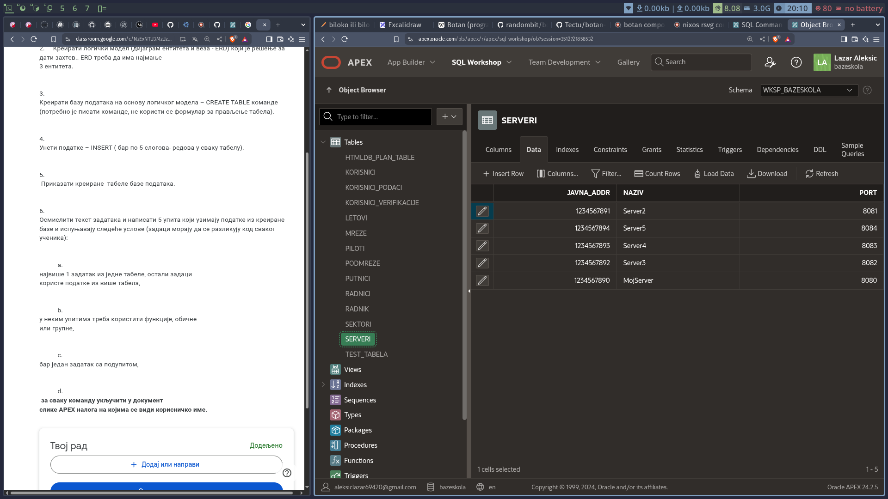
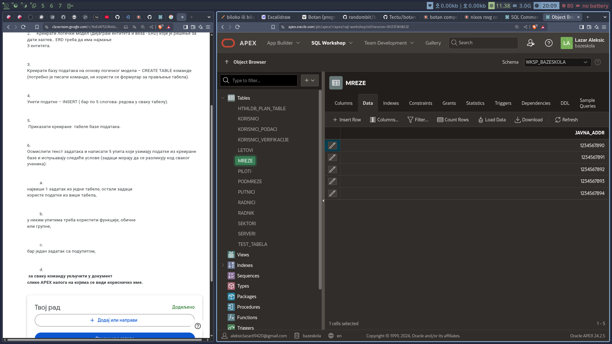
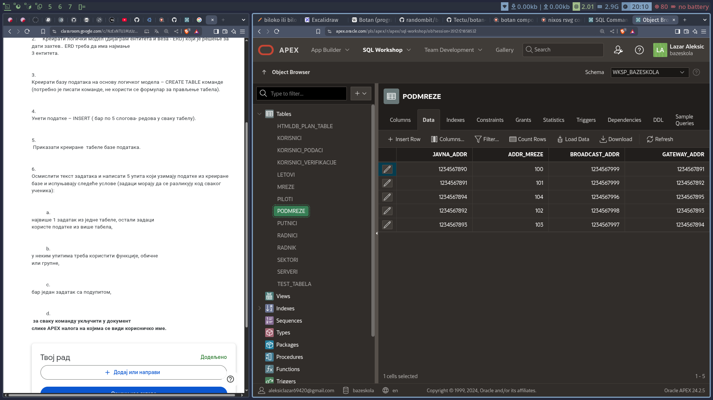

## Zadaci

### Prvi zadatak

Koji su verifikovani korisnici na mreži?
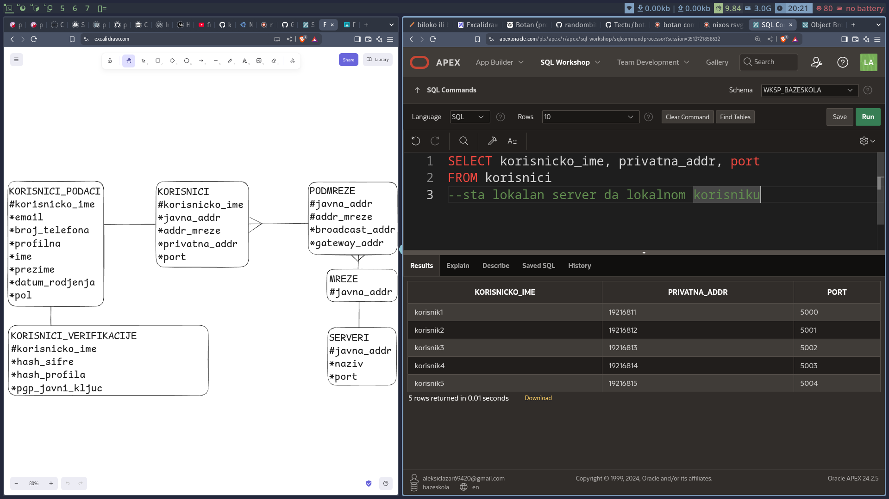

### Drugi zadatak

Ko je na serveru "MojServer"?
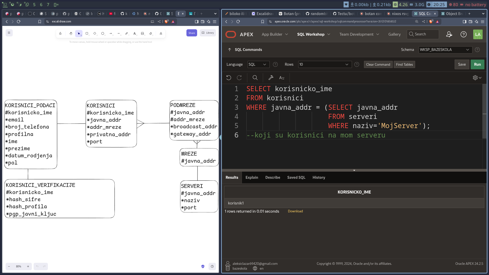

### Treci zadatak

Pronadji najduže korisničko ime na serveru ako je ono 
duže od 5 slova.
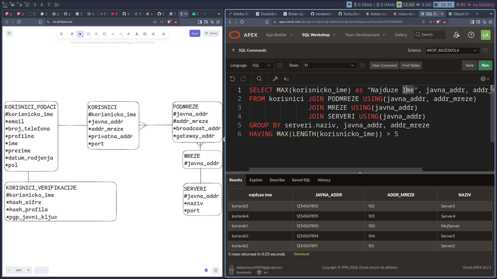

### Cetvrti zadatak

Napravi upit koji će kazati koliko podmreža imamo na jednoj mreži.
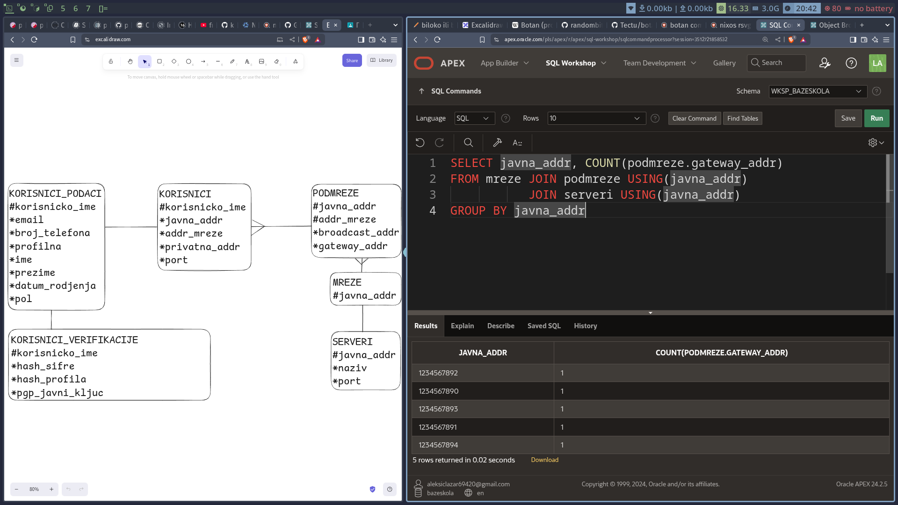
### Peti zadatak

Napravi unikatan identifikator za svakog korisnika tako što
od svakog stringa (varchar-a) koji korisnik ima uzmeš po prva 
dva slova.
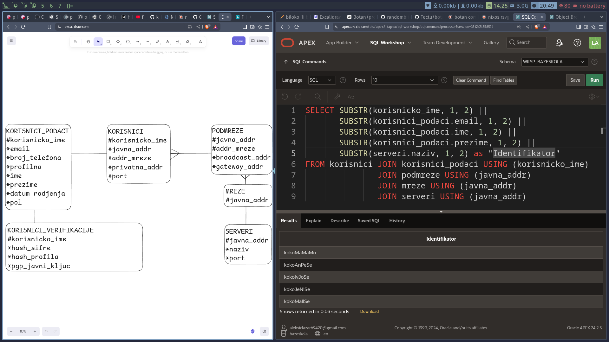

# Kraj

Svi su zadaci provereni i rade i na sqlite.  
Svi materijali su dostupni na mom [github-u](https://github.com/kripticni/Gim-IT-III-godina/tree/main/Baze%20Podataka/Projekti/kritpicni)  
gde možete i naći sqlite bazu u db direktorijumu.  
Docx fajl konvertovan iz markdown jezika uz pomoću pandoc programa.
