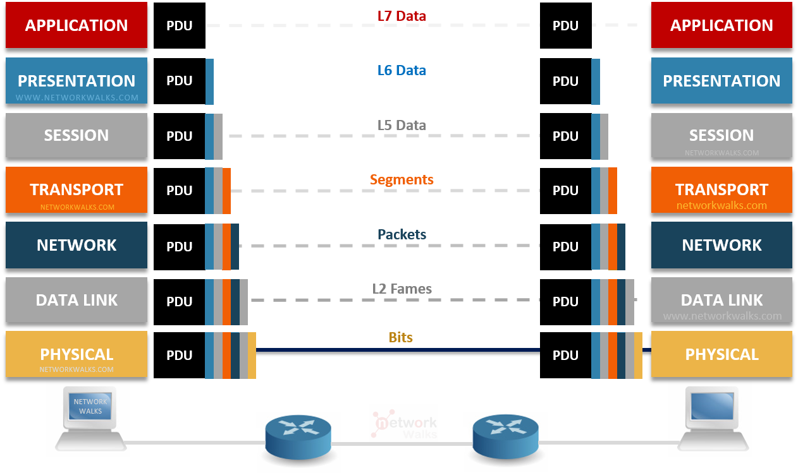

# Projekat PeerSpeak

Poenta projekta PeerSpeak je da osiguramo komunikaciju
u lokalnoj mrezi koja je laka za ostvarivanje, privatna
brza i sigurna. Osim toga komunikacija je PeerToPeer
tako da nemamo nikakvih servera ni autentifikacije.



U sklopu projekta sam se potrudio da lepo 
odradim sve OSI modele:
2. Klasa sistem koja prikazuje mac adrese.
3. U sklopu koda za slanje poruka i 
izabiranje nic-a i mreze.
4. U vidu koriscenja SSL-a za slanje poruka.
5. U vidu razlicitih sesija za caskanje.
6. Kao graficki interfejs i razmena slika i faljova.
7. U vidu P2PChat protokola.

## Tabela sadržaja

### Interfejsi

- [IFajl](#ifajl)

### Klase

- [Osoba](#osoba)
- [Korisnik](#korisnik)
- [Mreza](#mreza)
- [Sistem](#sistem)
- [Peer](#peer)
- [Netcalc](#netcalc)
- [Pair](#pair)
- [Datum](#datum)

### Prozori

- [Forma](#form)
- [Chat](#chat)

## IFajl

Prost interfejs koji osigurava da klasa koja
ga nasledi implementira metode i atribute
za cuvanje i ucitavnje iz fajla.

```cs
public interface IFajl
{
    string podrazumevani_fajl { get; set; }
    void Pisi(string put);
    void Pisi();
    void Citaj(string put);
    void Citaj();
}
```

## Osoba

```cs
public abstract class Osoba : IFajl
```

Abstraktna klasa koja nasledjuje interfejs 
IFajl, i ima atribute za ime, prezime, datum rodjenja
koji se sluzi kompozicijom iz klase Datum, starost
i pol.

```cs
    //nezasticeno za string.Empty, sluzi za izvedene klase
    protected Osoba()
    {
		ime = string.Empty;
		prezime = string.Empty;
		datum_rodjenja = Datum.Parse("01/01/1970");
		pol = false;
    }

    public Osoba(string _ime, string _prezime, Datum _datum_rodjenja, bool _pol)
	{
		Ime = _ime;
		Prezime = _prezime;
		DatumRodjenja = _datum_rodjenja;
		pol = _pol;
	}

    public Osoba(string _ime, string _prezime, Datum _datum_rodjenja, string _pol)
    {
        Ime = _ime;
        Prezime = _prezime;
        DatumRodjenja = _datum_rodjenja;
        Pol = _pol;
    }

    public Osoba(string put)
	{
		this.Citaj(put);
	}
```

Konstruktori za klasu.

```cs
	protected string ime;
	protected string prezime;

	public string Ime {
		get { return ime; }
		protected set {
			if (value != string.Empty)
				ime = value;
			else
				throw new ArgumentException("Losa Vrednost");
		}
	}
	public string Prezime {
		get { return prezime; }
        protected set{
            if (value != string.Empty)
                prezime = value;
            else
                throw new ArgumentException("Losa Vrednost");
        }
    }

    public string PunoIme => $"{Ime} {Prezime}";
    //skracenica za get i string interpolacija
```

Ovde throw-ujemo argument exception jer je vise deklarativno
za try-catch-ovanje jer mozemo da eksplicitno imamo catch
za ovaj exception.

```cs
	public Datum DatumRodjenja
	{
		get { return datum_rodjenja; }
		protected set
		{
			datum_rodjenja = value;
		}
	}
	public int Starost { get { return DatumRodjenja.Starost; } }
```

O klasi Datum cemo vise pricati kasnije kad dodjemo do nje.

```cs
	protected bool pol;

	public static bool PolToBool(string pol)
	{
		if (pol == "Musko")
			return true;
		else
			return false;
	}
	public string Pol
	{
		get
		{
			if (pol == true)
				return "Musko";
			else
				return "Zensko";
		}
		protected set
		{
			pol = PolToBool(value);
		}
	}
```

Poprilicno prosto, cuvamo bool umesto string za vecu sigurnost.


```cs
    public override int GetHashCode()
    {
        string podaci = $"{Ime}{Prezime}{DatumRodjenja.ToString()}{Pol}";
        return podaci.GetHashCode();
    }

    public override bool Equals(object obj)
    {
		if(obj is Osoba other){
			if (this.Ime == other.Ime &&
				this.Prezime == other.Prezime &&
				this.DatumRodjenja == other.DatumRodjenja &&
				this.Pol == other.Pol)
				return true;
		}
        return false;
    }

    public static bool operator ==(Osoba a, Osoba b)
    {
        return a.Equals(b);
    }

    public static bool operator !=(Osoba a, Osoba b)
    {
        return !a.Equals(b);
    }
```

Ove dve funkcije implementiramo u nasu klasu da
bi smo mogli da je koristimo u sklopu standardnog
hashset-a i imamo operatore cisto jer su trivialni
kada imamo vec equals metodu.


```cs
   #region interface
    virtual public string podrazumevani_fajl { get; set; } = "osoba.txt";

	//ovde koristimo virtual jer hocemo da
	//osoba ima svoju podrazumevanu implementaciju
	//i jer hocemo da override-ujemo u izvedenim klasama
    virtual public void Pisi(string put)
    {
        StreamWriter w = new StreamWriter(put);
        w.WriteLine(Ime);
        w.WriteLine(Prezime);
        w.WriteLine(DatumRodjenja.ToString());
        w.WriteLine(Pol);
        w.Close();
    }
    virtual public void Pisi()
    {
        StreamWriter w = new StreamWriter(podrazumevani_fajl);
        w.WriteLine(Ime);
        w.WriteLine(Prezime);
        w.WriteLine(DatumRodjenja.ToString());
        w.WriteLine(Pol);
        w.Close();
    }
    virtual public void Citaj(string put) {
		StreamReader r = new StreamReader(put);
        Ime = r.ReadLine();
        Prezime = r.ReadLine();
        DatumRodjenja = Datum.Parse(r.ReadLine());
        Pol = r.ReadLine();
        r.Close();
	}
    virtual public void Citaj()
    {
        StreamReader r = new StreamReader(podrazumevani_fajl);
        Ime = r.ReadLine();
        Prezime = r.ReadLine();
        DatumRodjenja = Datum.Parse(r.ReadLine());
        Pol = r.ReadLine();
        r.Close();
    }
    #endregion
```

Implementacija za nasledjen interfejs IFajl.

## Korisnik

```cs
public class Korisnik : Osoba, IFajl
```

Izvedena klasa koja nasledjuje i Osobu
i nasledjuje IFajl. Nasledjivanje za IFajl
nije neophodno ali je vise deklarativno za
one koji ne znaju da osoba bez nasledjuje IFajl.
Atributi koji su dodati na klasu osoba iz korisnika:
korisnico ime, email, broj telefona, profilna.

```cs
    public Korisnik(string _ime, string _prezime, Datum _datum_rodjenja, bool _pol, string _korisnicko_ime, string _email, string _broj_telefona, string _put_do_slike)
		: base(_ime, _prezime, _datum_rodjenja, _pol)
    {
		KorisnickoIme = _korisnicko_ime;
		Email = _email;
		BrojTelefona = _broj_telefona;
		promeniProfilnu(_put_do_slike);
    }

    public Korisnik(string _ime, string _prezime, Datum _datum_rodjenja, string _pol, string _korisnicko_ime, string _email, string _broj_telefona, string _put_do_slike)
     : base(_ime, _prezime, _datum_rodjenja, _pol)
    {
        KorisnickoIme = _korisnicko_ime;
        Email = _email;
        BrojTelefona = _broj_telefona;
        promeniProfilnu(_put_do_slike);
    }

	public Korisnik(string[] podaci)
	{
		Ime = "nepoznato";
		Prezime = "nepoznato";
		DatumRodjenja = Datum.Parse("01/01/1970");
		Pol = "Musko";
		KorisnickoIme = "nepoznato";
		Email = "nepoznato@nepoznato";
		BrojTelefona = "+(000) 000 0000000";
		promeniProfilnu("defaultmalepfp.jpg");
		foreach(string linija in podaci)
		{
			if (linija.StartsWith("Ime: ")) Ime = linija.Substring("Ime: ".Length);
			if (linija.StartsWith("Prezime: ")) Prezime = linija.Substring("Prezime: ".Length);
			if (linija.StartsWith("Datum rodjenja: ")) DatumRodjenja = Datum.Parse("01/01/1970");
			if (linija.StartsWith("Pol: ")) Pol = linija.Substring("Pol: ".Length);
			if (linija.StartsWith("Korisnicko ime: ")) KorisnickoIme = linija.Substring("Korisnicko ime: ".Length);
			if (linija.StartsWith("Email: ")) Email = linija.Substring("Email: ".Length);
			if (linija.StartsWith("Broj telefona: ")) BrojTelefona = linija.Substring("Broj telefona: ".Length);
			if (linija.StartsWith("Profilna: "))
			{
				string enkodirano = linija.Substring("Profilna: ".Length);
				if (enkodirano.StartsWith("defaultmalepfp.jpg"))
				{
					promeniProfilnu("defaultmalepfp.jpg");
					continue;
				}
				if (enkodirano.StartsWith("defaultfemalepfp.jpg"))
				{
					promeniProfilnu("defaultfemalepfp.jpg");
					continue;
				}
				//nema provere, ali sobzirom da je bitmap
				//i da je response ogranicen na 2mb, trebalo
				//bi da je sve u redu ovako
				profilna = DekodirajBitmapB64(enkodirano);
			}
		}
	}

	public Korisnik(string put)
	{
		this.Citaj(put);
	}

	public Korisnik()
	{
        Ime = "nepoznato";
        Prezime = "nepoznato";
        DatumRodjenja = Datum.Parse("01/01/1970");
        Pol = "Musko";
        KorisnickoIme = "nepoznato";
        Email = "nepoznato@nepoznato";
        BrojTelefona = "+(000) 000 0000000";
        promeniProfilnu("defaultmalepfp.jpg");
    }
```

Imamo dva puna konstruktora, jedan prazan konstruktor,
jedan konstruktor koji poziva na IFajl citaj za ucitavanje,
i jedan konstruktor koji moze da procita parcialne podatke
za klasu korisnik i iz nje sastavi objekat.


```cs
	private string korisnicko_ime;
    public string KorisnickoIme {
		get
		{
			return korisnicko_ime;
		}
		set
		{
			if (value == string.Empty)
				throw new ArgumentException("Losa Vrednost");
			korisnicko_ime = value;
		}
	}

    private string email;

	public static bool validanEmail(string email)
	{
		if (email == string.Empty)
			return false;
		return email.Contains("@");
	}

	public string Email
	{
		get
		{
			return email;
		}
		private set
		{
			if (validanEmail(value))
				email = value;
			else throw new ArgumentException("Losa Vrednost");
		}
	}

	private string broj_telefona;
    public static bool validanBrTelefona(string br_telefona)
    {
		if (br_telefona == string.Empty)
			return false;
        string sablon = @"^\+\(\d{3}\) \d{3} \d{6,7}$";
        return Regex.IsMatch(br_telefona, sablon);
    }
    public string BrojTelefona
	{
		get
		{
			return broj_telefona;
		}
		private set
		{
			if (validanBrTelefona(value))
				broj_telefona = value;
			else
				throw new ArgumentException("Losa Vrednost");
		}
	}
```

Implementacije za atribute sa prostim proverama, za email
cisto proveramo da li imaju @ karakter (mogli bi smo da 
iskljucimo ostale specijalne karatkere isto), za telefonski
broj proveravamo da li string match-uje na regex koji smo
zadali i za korisnicko ime proveravamo samo za null.

```cs
    public override int GetHashCode()
    {
		string podaci = $"{Ime}{Prezime}{DatumRodjenja.ToString()}{Pol}{KorisnickoIme}{Email}{BrojTelefona}{PutDoProfilne}";
		return podaci.GetHashCode();
    }

	public override bool Equals(object obj)
	{
		if(obj is Korisnik other){
			if (this.Ime == other.Ime &&
				this.Prezime == other.Prezime &&
				this.DatumRodjenja == other.DatumRodjenja &&
				this.Pol == other.Pol &&
				this.Email == other.Email &&
				this.BrojTelefona == other.BrojTelefona &&
				this.PutDoProfilne == other.PutDoProfilne)
				return true;
		}
		return false;
	}

	public static bool operator==(Korisnik a, Korisnik b)
	{
		return a.Equals(b);
	}

    public static bool operator !=(Korisnik a, Korisnik b)
    {
        return !a.Equals(b);
    }
```

Ponovo podrska za hashset i operatori uz put.


```cs
	public Bitmap profilna { get; private set; }
	
	private string put_do_profilne;
    public string PutDoProfilne { get { return put_do_profilne; }
		set
		{
			promeniProfilnu(value);
		}
	}
    public static bool validnaSlika(string put)
	{
		const int maxVelicina = 1 * 1024 * 1024; //1mb
		FileInfo file = new FileInfo(put);

		if (!File.Exists(put))
			return false;
        //throw new FileNotFoundException("Fajl nije pronadjen.");

        string[] ekstenzije = { ".jpg", ".jpeg", ".png", ".bmp", ".gif", ".tiff", ".tif", ".ico" };
		if (!ekstenzije.Contains(file.Extension.ToLower()))
			return false;

		if (file.Length > maxVelicina)
			return false;
        //throw new Exception("Fajl je veci od 1mb.");

        return true;
	}

	public void promeniProfilnu(string put)
	{
		if (!validnaSlika(put))
			throw new Exception("Slika nije validna");
		try
		{
			using (FileStream fs = new FileStream(put, FileMode.Open, FileAccess.Read))
			{
				Image img = Image.FromStream(fs, false, true);
				profilna?.Dispose();
				profilna = new Bitmap(img);
			}
			put_do_profilne = put;
		}
		catch (Exception)
		{
			throw new Exception("Slika nije validna");
		}
	}

	public void postaviProfilnu(PictureBox pb)
	{
		if (profilna == null)
			throw new Exception("Nije ucitana profilna");

		if (pb.Image != null)
			pb.Image.Dispose();

		pb.Image = profilna;
		//deli referencu jer hocu
		//da direktno povezem klasu
		//sa taj picturebox
	}

    public string EnkodirajBitmapB64(Bitmap bitmap, ImageFormat format)
    {
        using (MemoryStream ms = new MemoryStream())
        {
            bitmap.Save(ms, format);
            byte[] imageBytes = ms.ToArray();
            return Convert.ToBase64String(imageBytes);
        }
    }

    // Decode Base64 string to Bitmap
    public static Bitmap DekodirajBitmapB64(string base64)
    {
        byte[] imageBytes = Convert.FromBase64String(base64);
        using (MemoryStream ms = new MemoryStream(imageBytes))
        {
            return new Bitmap(ms);
        }
    }
```

Sve sto nam je neophodno za sliku sa puno provera i metode
za enkodiranje i dekodiranje kada saljemo preko interneta 
koristeci base64. Za svaku sliku se proverava ekstenzija,
velicina, tip fajla (odredjen byte-ovima) i da li slika 
postoji na filesystem-u.

```cs
    #region interface
    override public string podrazumevani_fajl { get; set; } = "korisnik.txt";
	override public void Pisi(string put)
    {
        StreamWriter w = new StreamWriter(put);
        w.WriteLine(Ime);
        w.WriteLine(Prezime);
        w.WriteLine(DatumRodjenja.ToString());
        w.WriteLine(Pol);
		w.WriteLine(KorisnickoIme);
		w.WriteLine(Email);
		w.WriteLine(BrojTelefona);
		w.WriteLine(PutDoProfilne);
        w.Close();
    }
    override public void Pisi()
    {
        StreamWriter w = new StreamWriter(podrazumevani_fajl);
        w.WriteLine(Ime);
        w.WriteLine(Prezime);
        w.WriteLine(DatumRodjenja.ToString());
        w.WriteLine(Pol);
        w.WriteLine(KorisnickoIme);
        w.WriteLine(Email);
        w.WriteLine(BrojTelefona);
        w.WriteLine(PutDoProfilne);
        w.Close();
    }
    override public void Citaj(string put)
    {
        StreamReader r = new StreamReader(put);
        Ime = r.ReadLine();
        Prezime = r.ReadLine();
        DatumRodjenja = Datum.Parse(r.ReadLine());
        Pol = r.ReadLine();
        KorisnickoIme = r.ReadLine();
        Email = r.ReadLine();
        BrojTelefona = r.ReadLine();
        promeniProfilnu(r.ReadLine());
        r.Close();
    }
    override public void Citaj()
    {
		StreamReader r = new StreamReader(podrazumevani_fajl);
        Ime = r.ReadLine();
        Prezime = r.ReadLine();
        DatumRodjenja = Datum.Parse(r.ReadLine());
        Pol = r.ReadLine();
        KorisnickoIme = r.ReadLine();
        Email = r.ReadLine();
        BrojTelefona = r.ReadLine();
        promeniProfilnu(r.ReadLine());
        r.Close();
    }
    #endregion
```

Implementacija za interfejs IFajl.


## Mreza

Klasa mreze je daleko van opsega onog sto smo
ucili u skoli za objektno orijentisano programiranje
i bavi se mrezama tako da je necu objasnjivati,
klasa je sama ali koristi mnoge metode iz NetCalc klase.

```cs
public class Mreza
{
    public Mreza(NetworkInterface nic)
    {
        Nic = nic;
    }
    public Mreza(NetworkInterface nic, IPAddress addr)
    {
        Nic = nic;
        PrivateIP = addr;
    }

    private NetworkInterface nic;
    public NetworkInterface Nic {
        get { return nic; }
        set
        {
            bool exists = false;
            foreach (var NIC in NetworkInterface.GetAllNetworkInterfaces())
                if (NIC.Id == value.Id)
                {
                    exists = true;
                    break;
                }
            if (!exists)
                throw new ArgumentException("Adapter ne postoji.");
            nic = value;
            GetNicType();
            GetMAC();
        }
    }

    public static NetworkInterface NicParse(string name)
    {
        foreach (var NIC in NetworkInterface.GetAllNetworkInterfaces())
            if (NIC.Name == name)
                return NIC;
        throw new ArgumentException("Adapter ne postoji");
    }

    public NetworkInterfaceType NicType { get; private set; }
    public PhysicalAddress MAC { get; private set; }
    private void GetMAC()
    {
        MAC = Nic.GetPhysicalAddress();
    }
    private void GetNicType()
    {
        NicType = Nic.NetworkInterfaceType;
    }

    private IPAddress privateip;
    public IPAddress PrivateIP {
        get { return privateip; }
        set {
            bool exists = false;
            foreach(var addr in Nic.GetIPProperties().UnicastAddresses)
            {
                if(addr.Address.ToString() == value.ToString())
                {
                    exists = true;
                    break;
                }
            }
            if (!exists)
                throw new ArgumentException($"Adresa {value.ToString()} ne postoji za adapter.");

            privateip = value;
            if (PrivateIP.AddressFamily == AddressFamily.InterNetwork)
                isPrivateIPv4 = true;
            else
                isPrivateIPv4 = false;

            GetPublicIP();
            SubnetAndPrefix();
            DefaultGateway();
            GetDHCP();
        }
    }
    public bool isPrivateIPv4 { get; private set; }
    public IPAddress PublicIP { get; private set; }
    public bool isPublicIPv4 { get; private set; }

    private void GetPublicIP()
    {
        //prvo razresimo ip addr od api-ja
        IPAddress resolved_remote;
        //https://api.ipify.org
        const string PublicIPService = "api.ipify.org";
        try
        {
            IPAddress[] host = Dns.GetHostAddresses(PublicIPService);
            resolved_remote = host[0];
        }
        catch (Exception ex)
        {
            throw new Exception($"Greska pri razresavanju adrese \"{PublicIPService}\". {ex}");
        }
        IPEndPoint local = new IPEndPoint(PrivateIP, 0);
        IPEndPoint remote = new IPEndPoint(resolved_remote, 443); //port 443 za https

        TcpClient client = new TcpClient();

        client.Client.Bind(local);
        client.Connect(remote);
        SslStream sslStream = new SslStream(client.GetStream());
        sslStream.AuthenticateAsClient(PublicIPService);

        string request = $"GET / HTTP/1.1\r\nHost: {PublicIPService}\r\nConnection: close\r\n\r\n";
        byte[] requestBytes = Encoding.ASCII.GetBytes(request);
        sslStream.Write(requestBytes);
        sslStream.Flush();

        StreamReader r = new StreamReader(sslStream, Encoding.ASCII);
        while (!r.EndOfStream)
        {
            //parseujemo liniju po liniju od response za
            //liniju sa ip addresom
            string line = r.ReadLine();
            if(IPAddress.TryParse(line, out IPAddress ip))
            {
                PublicIP = ip;
                if (ip.AddressFamily == AddressFamily.InterNetwork)
                    isPublicIPv4 = true;
                else if (ip.AddressFamily == AddressFamily.InterNetworkV6)
                    isPublicIPv4 = false;
                //Console.WriteLine(line); // za debug, Project Properties -> Application -> App Type
                break;
            }
            //Console.WriteLine(line);
        }
        client.Close();
    }

    public IPAddress Subnet { get; private set; }
    public int PrefixLength { get; private set; }
    //resenje je bilo da proverimo dereferencirane vrednosti
    private void SubnetAndPrefix()
    {
        //Console.WriteLine("Pokrenuto");
        if (isPrivateIPv4)
        {
            foreach (UnicastIPAddressInformation unicast1 in Nic.GetIPProperties().UnicastAddresses)
                if (unicast1.Address.ToString() == PrivateIP.ToString())
                {
                    PrefixLength = unicast1.PrefixLength;
                    Subnet = unicast1.IPv4Mask;
                    //Console.WriteLine($"{Subnet}");
                }
        }
        else
        {
            foreach (UnicastIPAddressInformation unicast2 in Nic.GetIPProperties().UnicastAddresses)
                if (unicast2.Address.ToString() == PrivateIP.ToString())
                {
                    PrefixLength = unicast2.PrefixLength;
                    Subnet = new IPAddress(NetCalc.CreateSubnetMaskV6(PrefixLength));
                    //Console.WriteLine($"{Subnet}");
                }
        }
    }

    public IPAddress NetworkPrefix
    {
        get{ return NetCalc.LowestAddressInNet(PrivateIP, Subnet); }
    }

    public IPAddress Broadcast //ustvari je najveca mreza u subnet-u za v6
    {
        get{ return NetCalc.HighestAddressInNet(PrivateIP, Subnet); }
    }

    public BigInteger HostsInSubnet
    {
        get { return HostsInSubnetV6; } //radi za oba slucaja
    }

    public BigInteger HostsInSubnetV6
    {   // - 3 jer gateway, adresa mreze i broadcast adresa nisu hostovi
        get { return NetCalc.AddressDifferenceV6(Broadcast, NetworkPrefix) - 3; }
    }

    public int HostsInSubnetV4
    {
        get { return NetCalc.AddressDifferenceV4(Broadcast, NetworkPrefix) - 3; }
    }

    //ip verzija od gateway isto zavisi od lokalne ip verzije
    public IPAddress Gateway { get; private set; }
    private void DefaultGateway()
    {
        //moze da pravi problemi ako nic podrzava vise gateway
        //adresa za obe adresne porodice, ali to se nece desiti za
        //nijedan desktop racunar
        foreach (var gateway in Nic.GetIPProperties().GatewayAddresses)
            if (gateway.Address.AddressFamily == PrivateIP.AddressFamily)
                Gateway = gateway.Address;
    }

    public bool DHCP { get; private set; }
    private void GetDHCP()
    {
        if (isPrivateIPv4)
            // ?. null-conditional operator, ako GetIPV4... vrati null cela ekspresija
            // postaje null umesto da dobijemo exception
            // ?? null-coalescing operator, ako je ekspresija null, vraca drugu ekspresiju (false)
            DHCP = Nic.GetIPProperties().GetIPv4Properties()?.IsDhcpEnabled ?? false;
        else
            DHCP = false; //C# nema biblioteke koje dozvoljavaju da razresimo ovo za IPv6
    }
}
```

## Sistem

Sistem je staticka klasa, to znaci da za nju ne mozemo da
dobijemo instancu odnosno objekat, tako da new Sistem() 
nije validan kod. Umesto toga sve metode i svi atributi
klase mogu da se pozovu i bez objekta prosto preko
`<Ime Klase>.<Metoda/Atribut>`

Klasa sistem je staticka jer ona racuna/vraca stvari
u vezi sistema koje se nikad ne menjaju na osnovu 
unutrasnjeg stanja pa nemamo potrebe za objekat
koji bi pratio unutrasnja stanja.

Sadrzi OS, Hostname, BatteryPrecent, ChargeStatus
i jos nekoliko dodatnih funkcija za izlistavanje adresa
i slicno tome.

```cs
public static class Sistem
{
    static public string OS
    {
        get { return RuntimeInformation.OSDescription; }
    }

    static public string Hostname
    {
        get { return System.Net.Dns.GetHostName(); }
    }

    static public string BatteryPercent
    {
        get {
            PowerStatus ps = SystemInformation.PowerStatus;
            return Convert.ToString(ps.BatteryLifePercent * 100);
        }
    }
    static public string ChargeStatus
    {
        get {
            PowerStatus ps = SystemInformation.PowerStatus;
            return ps.BatteryChargeStatus.ToString();
        }
    }

    public static List<IPAddress> AllPrivateIPs()
    {
        List<IPAddress> list = new List<IPAddress>();
        foreach (NetworkInterface nic in NetworkInterface.GetAllNetworkInterfaces())
            foreach (UnicastIPAddressInformation address in nic.GetIPProperties().UnicastAddresses)
                    list.Add(address.Address);
        return list;
    }

    public static List<IPAddress> AllPrivateIPv4()
    {
        List<IPAddress> list = new List<IPAddress>();
        foreach (NetworkInterface nic in NetworkInterface.GetAllNetworkInterfaces())
            foreach (UnicastIPAddressInformation address in nic.GetIPProperties().UnicastAddresses)
                if(address.Address.AddressFamily == AddressFamily.InterNetwork)
                    list.Add(address.Address);
        return list;
    }

    public static List<IPAddress> AllPrivateIPv6()
    {
        List<IPAddress> list = new List<IPAddress>();
        foreach (NetworkInterface nic in NetworkInterface.GetAllNetworkInterfaces())
            foreach (UnicastIPAddressInformation address in nic.GetIPProperties().UnicastAddresses)
                if (address.Address.AddressFamily == AddressFamily.InterNetworkV6)
                    list.Add(address.Address);
        return list;
    }

    public static async Task<string> MainPublicIP()
    {
        using (HttpClient client = new HttpClient())
        {
            try
            {
                return await client.GetStringAsync("https://api.ipify.org");
            }
            catch
            {
                MessageBox.Show("Greska sa konekcijom.");
                return string.Empty;
            }
        }
    }
}
```

## Peer

Klasa Peer je izuzetno velika i kompleksna, ona nam omogucava
komunikaciju sa ostalim uredjajima na mrezi. U njoj je isto-vremeno i nas P2PChat protokol. Ova klasa koristi kompoziciju
za atribute Korisnik i Mreza, Korisnik sluzi za predstavljanje
drugima na mrezi, a Mreza za odredjivanje sa kojim adapterom
i adresom (pa zato i mrezom) cemo da se dopisujemo. 

Za komunikaciju koristimo TCP protokol nad kojim osiguravamo
transport sa SSL-om i na kraju preko toga stavljamo nas
P2PChat protokol za dopisivanje.

U klasi za komunikaciju koristimo:
- Listener, otvaramo socket na portu 51888 kako bi
nas drugi korisnici na mrezi nasli
- Port Scanner, skeniramo svakog korisnika u nasoj
lokalnoj mrezi za otvoren port 51888 i potvrdjujemo
da oni koriste nas P2PChat protokol i SSL certifikat.
- Packet Dispatcher, da bi smo sve pakete koje primimo
adekvatno poslali u odgovarajuce handler-e za njih

Sam protokol se sastoji od header-a za drugacije 
poruke/pakete i enum-a za svaki status.

Osim svega toga, klasa podrzava podesavanja za 
privatnost odnosno sta zelimo da prikazemo drugim 
na mrezi i vecina klase je asinhronisticka zbog
prirode koda za mreze. 

```cs
//sealed sprecava dalje nasledjivanje
public sealed class Peer : IFajl
{
    public Korisnik Korisnik;
    public Mreza Mreza;
    const int DEFAULT_PORT = 51888;
    public static readonly string REQUEST_SCAN = "P2PChat Scan Request";
    public static readonly string REQUEST_CHAT = "P2PChat Initiate Chat";
    public static readonly string MESSAGE_HEADER = "P2PChat Send Message: ";
    public static readonly string FILE_HEADER = "P2PChat Send File: ";
    public int Port { get; private set; }
    public byte PrivacySettings { get; private set; }
    public static readonly int IME_BIT = 0;
    public static readonly int PREZIME_BIT = 1;
    public static readonly int DATUM_BIT = 2;
    public static readonly int POL_BIT = 3;
    public static readonly int K_IME_BIT = 4;
    public static readonly int EMAIL_BIT = 5;
    public static readonly int BROJ_BIT = 6;
    public static readonly int PROFILNA_BIT = 7;

    public enum Status
    {
        Success,
        ProtocolUnconfirmed,
        DataExchanged,
        ConnectionClosed,
        ChatRequest,
        MessageReceived,
        FileReceived,
        BadPacket
    }

    public Peer(Korisnik k, Mreza m, byte ps)
    {
        Korisnik = k;
        Mreza = m;
        PrivacySettings = ps;
        Port = DEFAULT_PORT;
        Peers = new HashSet<Pair<IPAddress, Korisnik>>();
    }

    public Peer(string put, IPAddress ip)
    {
        this.Citaj(put);
        this.Mreza.PrivateIP = ip;
        Port = DEFAULT_PORT;
        Peers = new HashSet<Pair<IPAddress, Korisnik>>();
    }
    public Peer(string put)
    {
        this.Citaj(put);
        Port = DEFAULT_PORT;
        Peers = new HashSet<Pair<IPAddress, Korisnik>>();
    }

    public string FilteredData
    {
        get
        {
            string ret = "";
            if (NetCalc.isBitSet(PrivacySettings, IME_BIT)) ret += $"Ime: {Korisnik.Ime}\n";
            if (NetCalc.isBitSet(PrivacySettings, PREZIME_BIT)) ret += $"Prezime: {Korisnik.Prezime}\n";
            if (NetCalc.isBitSet(PrivacySettings, DATUM_BIT)) ret += $"Datum rodjenja: {Korisnik.DatumRodjenja.ToString()}\n";
            if (NetCalc.isBitSet(PrivacySettings, POL_BIT)) ret += $"Pol: {Korisnik.Pol}\n";
            if (NetCalc.isBitSet(PrivacySettings, K_IME_BIT)) ret += $"Korisnicko ime: {Korisnik.KorisnickoIme}\n";
            if (NetCalc.isBitSet(PrivacySettings, EMAIL_BIT)) ret += $"Email: {Korisnik.Email}\n";
            if (NetCalc.isBitSet(PrivacySettings, BROJ_BIT)) ret += $"Broj telefona: {Korisnik.BrojTelefona}\n";
            if (NetCalc.isBitSet(PrivacySettings, PROFILNA_BIT))
            {
                if (Korisnik.profilna == null)
                    throw new ArgumentNullException("Profilna nije postavljena");
                if (Korisnik.PutDoProfilne != "defaultmalepfp.jpg" && Korisnik.PutDoProfilne != "defaultfemalepfp.jpg")
                    ret += $"Profilna: {Korisnik.EnkodirajBitmapB64(Korisnik.profilna, ImageFormat.Png)}\n";
                else
                    ret += $"Profilna: {Korisnik.PutDoProfilne}";
            }
            return ret;
        }
    }

    //hocemo da cuvamo sve pronadjene peer-ove u hashsetu
    //koristimo hashset da ne bi dodali iste profile vise puta
    //idealno bi i set isto radio (cak bolje), ali nemamo set u C#
    //kad smo vec primorani da koristimo hashset, nasa Pair klasa
    //ce da daje hash i proverava za jednakost jedino vezano za Pair.first
    //da bi imali neku korist od nje
    public HashSet<Pair<IPAddress, Korisnik>> Peers { get; set; }

    public static Pair<IPAddress, Korisnik> MakePeer(IPAddress ip, Korisnik k)
    {
        return new Pair<IPAddress, Korisnik>(ip, k);
    }
    public static bool SetUpdate<T>(HashSet<T> set, T item)
    {
        if (set.Contains(item))
        {
            set.Remove(item);
            set.Add(item);
            return true;
        }
        set.Add(item);
        return false;
    }
    private bool SetUpdate(HashSet<Pair<IPAddress,Korisnik>> set, Pair<IPAddress,Korisnik> item)
    {
        if (set.Contains(item))
        {
            set.Remove(item);
            set.Add(item);
            return true;
        }
        set.Add(item);
        return false;
    }

    public string ListenerAddressString
    {
        get { return $"{Mreza.PrivateIP.ToString()}:{Port.ToString()}"; }
    }
    public Pair<IPAddress,int> ListenerAddress
    {
        get { return new Pair<IPAddress, int>(Mreza.PrivateIP, Port); }
    }

    //koristimo da bi mogli van klasu da napravimo
    //CancellationTokenSource koj ce da kontrolise
    //kolko dugo cemo da skeniramo ili slusamo
    //CancellationTokenSource cts = new...
    //cts.Close() bi zatvorio listener
    public async Task Listener(CancellationToken LCancelToken)
    {
        TcpListener listener = new TcpListener(Mreza.PrivateIP, Port);
        listener.Start();

        try
        {
            while (!LCancelToken.IsCancellationRequested)
            {
                Task<TcpClient> acceptTask = listener.AcceptTcpClientAsync(); //zapravo listener task
                Task completedTask = await Task.WhenAny(acceptTask, Task.Delay(Timeout.Infinite, LCancelToken));
                //completed task spaja infinite sleep koji se prekida na cancellation token sa nas listener
                //completed task sadrzi task koji se *prvi* zavrsi od ova dva taska
                //a zato sto je sleep infinite on se jedino zavrsava na cancellation
                //tako da kad nas completed task nije listener, onda break-ujemo sto
                //zavrsava oba taska na return

                if (completedTask == acceptTask)
                {
                    TcpClient client = acceptTask.Result;
                    _ = RespondInfo(client);
                    //multithreadujemo da bi mogli da obradimo vise konekcija odjednom
                }
                else
                {
                    break;
                }
            }
        }
        catch (OperationCanceledException)
        {
            //nista
        }
        finally
        {
            listener.Stop(); //u oba slucaja gasimo
        }
    }

    private async Task RespondInfo(TcpClient client)
    {

        IPAddress connected = ((IPEndPoint)client.Client.RemoteEndPoint).Address;
        Console.WriteLine($"Povezan od strane {connected.ToString()}");

        try
        {
            Pair<StreamReader,StreamWriter> rw_ssl = await GetServerSSl(client);
            StreamReader reader = rw_ssl.first;
            StreamWriter writer = rw_ssl.second;

            Pair<Status,Korisnik> response = await ServerHandshake(reader, writer);
            if (response.first == Status.ProtocolUnconfirmed)
                return;

            Pair<IPAddress, Korisnik> peer = new Pair<IPAddress, Korisnik>(connected, response.second);
            SetUpdate(Peers, peer);

            if (response.first == Status.DataExchanged)
                return;

            if(response.first == Status.ChatRequest)
                StartChat(reader, writer, this, peer);
        }
        catch (Exception ex)
        {
            Console.WriteLine($"{connected.ToString()}: {ex.Message}");
        }
    }

    private async Task<Pair<StreamReader, StreamWriter>> GetServerSSl(TcpClient client)
    {
        NetworkStream netStream = client.GetStream();
        SslStream sslStream = new SslStream(netStream, false);
        try
        {
            X509Certificate2 serverCertificate = new X509Certificate2("P2PChatCert.pfx",
                                                 password: "PeerToPeerChatCertificate");
            await sslStream.AuthenticateAsServerAsync(
                serverCertificate,
                clientCertificateRequired: true,
                enabledSslProtocols: System.Security.Authentication.SslProtocols.Tls12,
                checkCertificateRevocation: false);
        }
        catch
        {
            throw new Exception("Client nije autentifikovao ssl certifikat.");
        }
        //object initializer, postavljamo atribut odma nakon konstruktora
        StreamReader reader = new StreamReader(sslStream);
        StreamWriter writer = new StreamWriter(sslStream) { AutoFlush = true };
        Console.WriteLine("Imamo ssl stream");
        return new Pair<StreamReader,StreamWriter>(reader, writer);
    }

    private async Task<Pair<Status,Korisnik>> ServerHandshake(StreamReader r, StreamWriter w)
    {
        string received = await r.ReadLineAsync();
        Console.WriteLine($"Primljeno: {received}");
        if (received != REQUEST_SCAN && received != REQUEST_CHAT)
            return new Pair<Status, Korisnik>(Status.ProtocolUnconfirmed, null);

        Korisnik connected_profile;
        try
        {
            connected_profile = await SendAndReceive(r, w);
        }
        catch
        {
            return new Pair<Status, Korisnik>(Status.ConnectionClosed, null);
        }
        if (received == REQUEST_CHAT)
            return new Pair<Status, Korisnik>(Status.ChatRequest, connected_profile);
        else return new Pair<Status, Korisnik>(Status.DataExchanged, connected_profile);
    }

    private async Task<Korisnik> SendAndReceive(StreamReader r, StreamWriter w)
    {
        const int maxSize = 2 * 1024 * 1024; //ne prihavata vise od 2mb u povratku
        //ako neko pokusava da zloupotrebi otvoren port
        //proveravamo da li je zahtev od aplikacije ili ne
        await w.WriteAsync(FilteredData);
        Console.WriteLine($"Postalo {FilteredData}");

        //kad posaljemo nase informacije, isto pitamo za njihove jer smo potvrdili
        //da koriste nas protokol malopre, pa citamo i cuvamo
        char[] buffer = new char[maxSize];
        _ = await r.ReadAsync(buffer, 0, maxSize); //ostavljamo kolko smo byta procitali je nemamo upotrebu
        string full_response = new string(buffer);
        string[] response = full_response.Split(new[] { "\r\n", "\n", "\r" }, StringSplitOptions.None);
        Korisnik connected_profile = new Korisnik(response);
        Console.WriteLine($"Primljeno {full_response}");

        return connected_profile;
    }

    public async Task<HashSet<Pair<IPAddress, Korisnik>>> ScanLocalNet(TextBox textBox, CancellationToken SCancelToken)
    {
        TcpClient client = new TcpClient(); //promenjiva za povezivanje
        while(!SCancelToken.IsCancellationRequested) //zauvek se ponavlja
        for (IPAddress i = NetCalc.IncrementAddress(Mreza.NetworkPrefix);
            NetCalc.isLowerAddress(i, Mreza.Broadcast)
            && !SCancelToken.IsCancellationRequested;
            NetCalc.IncrementAddress(ref i))
        {
                try
                {
                    //preskacemo sebe, adresu mreze, i gateway
                    if (i.ToString() == Mreza.PrivateIP.ToString() || i.ToString() == Mreza.Gateway.ToString())
                        continue;
                    Console.WriteLine($"Pokusavamo {i.ToString()}:{Port.ToString()}");
                    textBox.Text = i.ToString();

                    client = new TcpClient();
                    var connectTask = client.ConnectAsync(i, Port);
                    var timeoutTask = Task.Delay(500);

                    if (await Task.WhenAny(connectTask, timeoutTask) == connectTask)
                    {
                        Pair<StreamReader, StreamWriter> rw_ssl = await GetClientSSL(client);
                        StreamReader reader = rw_ssl.first;
                        StreamWriter writer = rw_ssl.second;

                        Korisnik found = await ClientHandshake(reader, writer);
                        SetUpdate(Peers, new Pair<IPAddress, Korisnik>(i, found));
                    }
                }
                catch (Exception ex)
                {
                    Console.WriteLine($"{i.ToString()}:{Port.ToString()}, {ex}");
                    //brisemo kontakt iz hashseta ako nije uspesna konekcija
                    Peers.Remove(new Pair<IPAddress, Korisnik>(i, new Korisnik()));
                }
                finally
                {
                    client.Dispose();
                }
        }
        return Peers;
    }

    private async Task<Pair<StreamReader,StreamWriter>> GetClientSSL(TcpClient client)
    {
        NetworkStream netStream = client.GetStream();
        SslStream sslStream = new SslStream(netStream, false,
            new RemoteCertificateValidationCallback((sender, cert, chain, sslPolicyErrors) => true));
        //za sigurnost bi korektno bilo => return cert.GetCertHashString() == "...";
        //ali necemo to da radimo

        try
        {
            X509Certificate2 clientCertificate = new X509Certificate2("P2PChatCert.pfx",
                                                 password: "PeerToPeerChatCertificate");
            X509CertificateCollection certs = new X509CertificateCollection { clientCertificate };
            await sslStream.AuthenticateAsClientAsync(
                targetHost: "P2PChatCert", //mora da se podudara sa DNS name na generisan cert
                clientCertificates: certs,
                enabledSslProtocols: System.Security.Authentication.SslProtocols.Tls12,
                checkCertificateRevocation: false);
        }
        catch
        {
            throw new Exception("Client se nije autentifikovao ili nije prihvatio nasu.");
        }

        StreamReader reader = new StreamReader(sslStream);
        StreamWriter writer = new StreamWriter(sslStream) { AutoFlush = true };

        return new Pair<StreamReader, StreamWriter>(reader, writer);
    }

    private async Task<Korisnik> ClientHandshake(StreamReader r, StreamWriter w)
    {
        //potvrdjujemo protokol
        Console.WriteLine($"Saljemo {REQUEST_SCAN}");
        await w.WriteLineAsync(REQUEST_SCAN);
        //citamo njihove podatke

        Korisnik found = await ReceiveAndSend(r, w);
        return found;
    }

    private async Task<Korisnik> ReceiveAndSend(StreamReader r, StreamWriter w)
    {
        const int maxSize = 2 * 1024 * 1024; //ne prihvata vise od 2mb

        //primamo
        char[] buffer = new char[maxSize];
        _ = await r.ReadAsync(buffer, 0, maxSize);
        string full_response = new string(buffer);
        string[] response = full_response.Split(new[] { "\r\n", "\n", "\r" }, StringSplitOptions.None);
        Korisnik found = new Korisnik(response);
        Console.WriteLine($"Primljeno {full_response}");

        //saljemo nase podatke
        Console.WriteLine($"Saljemo {FilteredData}");
        await w.WriteAsync(FilteredData);

        return found;
    }

    public async Task ConnectToPeer(Pair<IPAddress, Korisnik> Peer)
    {
        IPAddress ip = Peer.first;
        TcpClient client = new TcpClient();
        try
        {
            await client.ConnectAsync(ip, Port);

            Pair<StreamReader, StreamWriter> rw_ssl = await GetClientSSL(client);
            StreamReader reader = rw_ssl.first;
            StreamWriter writer = rw_ssl.second;

            await writer.WriteLineAsync(REQUEST_CHAT);
            Korisnik found = await ReceiveAndSend(reader, writer);

            Pair<IPAddress, Korisnik> peer = new Pair<IPAddress, Korisnik>(ip, found);
            SetUpdate(Peers, peer);
            StartChat(reader, writer, this, peer);
        }
        catch
        {
            MessageBox.Show("Veza nije uspostavljena");
            return;
        }
    }

    private void StartChat(StreamReader r, StreamWriter w, Peer self, Pair<IPAddress, Korisnik> peer)
    {
        Form2 form2 = new Form2(r, w, this, peer);
        form2.Show();
        form2.BringToFront();
        form2.Focus();
    }

    //sto se tice slanja, ne mozemo da cuvamo
    //streamwriter-e, streamreader-e, netstreamove
    //zajedno kao atribut klase jer zelimo da iz jednog
    //objekta imamo vise uspostavljenih konekcija koje generisemo
    //pa ce za funkcije za slanje i primanje preko uspostavljene
    //veze biti static i zahteva argumente reader/writer

    public static async Task SendFile(StreamWriter w, string path)
    {
        string b64_file = Convert.ToBase64String(File.ReadAllBytes(path));
        await w.WriteLineAsync($"{Peer.FILE_HEADER}{Path.GetFileName(path)}:{b64_file}");
    }

    public static async Task SendMessage(StreamWriter w, string msg)
    {
        await w.WriteAsync($"{Peer.MESSAGE_HEADER}{msg}");
        Console.Write($"Poslato: {Peer.MESSAGE_HEADER}{msg}");
    }

    public static async Task<Pair<Status,string>> PacketDispatcher(StreamReader r, Pair<IPAddress,Korisnik> peer)
    {
        string message = string.Empty;
        try
        {
            message = await r.ReadLineAsync();
            Console.WriteLine($"Primljeno: {message}");
        }
        catch { return new Pair<Status,string>(Status.ConnectionClosed, string.Empty); }

        if (message == string.Empty) //ovo se prakticno nikad nece desiti ali ako se desi je okej
            return new Pair<Status, string>(Status.Success, string.Empty);
        if (message == null) //ovde se jedino desava null ako readlineasync dobije kraj konekcije, pa gasimo
            return new Pair<Status, string>(Status.ConnectionClosed, string.Empty);

        if (message.StartsWith(Peer.MESSAGE_HEADER))
        {
            string handled_msg = HandleMessage(peer.second, message);
            return new Pair<Status, string>(Status.MessageReceived, handled_msg);
        }
        if (message.StartsWith(Peer.FILE_HEADER))
        {
            HandleFile(message);
            return new Pair<Status, string>(Status.FileReceived, string.Empty);
        }
        return new Pair<Status, string>(Status.BadPacket, string.Empty);
    }

    public static string HandleMessage(Korisnik k, string msg)
    {
        msg = msg.Substring(Peer.MESSAGE_HEADER.Length);
        return k.KorisnickoIme + ": " + msg + '\n';
    }

    public static void HandleFile(string msg)
    {
        string filename_b64file = msg.Substring(Peer.FILE_HEADER.Length);
        //ako je put sa folderima, izbacujemo sve osim imena fajla, ako to ne uradimo
        //dozvoljavamo da se sacuva i overwrite-uje fajl bilo gde na celom filesystem-u
        int separator_index = filename_b64file.IndexOf(":"); //delimo na filename i b64file
        string filename = Path.GetFileName(filename_b64file.Substring(0, separator_index));
        string b64_file = filename_b64file.Substring(separator_index + 1);

        MessageBox.Show($"Primljen fajl {filename}");
        byte[] file_bytes = Convert.FromBase64String(b64_file);
        string dirname = "PrimljeniFajlovi";
        string destination = ResolveNameCollision(dirname,filename);

        File.WriteAllBytes(destination, file_bytes);
    }

    public static string ResolveNameCollision(string dirname, string basename)
    {
        if (!File.Exists($"{dirname}/{basename}"))
            return $"{dirname}/{basename}";

        string name = Path.GetFileNameWithoutExtension(basename);
        string extension = Path.GetExtension(basename);
        int counter = 1;
        string new_filename = $"{dirname}/{name}({counter}){extension}";
        while (File.Exists(new_filename))
        {
            ++counter;
            new_filename = $"{dirname}/{name}({counter}){extension}";
        }
        return new_filename;
    }


    #region interface
    public string podrazumevani_fajl { get; set; } = "peer-profil.txt";
    public void Pisi(string put)
    {
        StreamWriter w = new StreamWriter(put);
        w.WriteLine(Korisnik.Ime);
        w.WriteLine(Korisnik.Prezime);
        w.WriteLine(Korisnik.DatumRodjenja.ToString());
        w.WriteLine(Korisnik.Pol);
        w.WriteLine(Korisnik.KorisnickoIme);
        w.WriteLine(Korisnik.Email);
        w.WriteLine(Korisnik.BrojTelefona);
        w.WriteLine(Korisnik.PutDoProfilne);
        w.WriteLine(this.PrivacySettings.ToString());
        w.WriteLine(Mreza.Nic.Name);
        w.WriteLine(Mreza.PrivateIP.ToString()); //soft checkujemo da li postoji
        w.Close();
    }
    public void Pisi()
    {
        StreamWriter w = new StreamWriter(podrazumevani_fajl);
        w.WriteLine(Korisnik.Ime);
        w.WriteLine(Korisnik.Prezime);
        w.WriteLine(Korisnik.DatumRodjenja.ToString());
        w.WriteLine(Korisnik.Pol);
        w.WriteLine(Korisnik.KorisnickoIme);
        w.WriteLine(Korisnik.Email);
        w.WriteLine(Korisnik.BrojTelefona);
        w.WriteLine(Korisnik.PutDoProfilne);
        w.WriteLine(this.PrivacySettings.ToString());
        w.WriteLine(Mreza.Nic.Name);
        w.WriteLine(Mreza.PrivateIP.ToString());
        w.Close();
    }
    public void Citaj(string put)
    {
        StreamReader r = new StreamReader(put);
        string Ime = r.ReadLine();
        string Prezime = r.ReadLine();
        Datum DatumRodjenja = Datum.Parse(r.ReadLine());
        string Pol = r.ReadLine();
        string KorisnickoIme = r.ReadLine();
        string Email = r.ReadLine();
        string BrojTelefona = r.ReadLine();
        string PutDoProfilne = r.ReadLine();
        this.PrivacySettings = byte.Parse(r.ReadLine());
        NetworkInterface nic = Mreza.NicParse(r.ReadLine());
        IPAddress privateip = IPAddress.Parse(r.ReadLine());
        Mreza = new Mreza(nic);
        try { Mreza.PrivateIP = privateip; } //verovatno se je promenio pa try catchujemo
        catch { MessageBox.Show("IP adresa se je promenila od proslog koriscenja, izaberite korektnu u configure."); }
        Korisnik = new Korisnik(Ime, Prezime, DatumRodjenja, Pol, KorisnickoIme, Email, BrojTelefona, PutDoProfilne);
        r.Close();
    }
    public void Citaj()
    {
        StreamReader r = new StreamReader(podrazumevani_fajl);
        string Ime = r.ReadLine();
        string Prezime = r.ReadLine();
        Datum DatumRodjenja = Datum.Parse(r.ReadLine());
        string Pol = r.ReadLine();
        string KorisnickoIme = r.ReadLine();
        string Email = r.ReadLine();
        string BrojTelefona = r.ReadLine();
        string PutDoProfilne = r.ReadLine();
        this.PrivacySettings = byte.Parse(r.ReadLine());
        NetworkInterface nic = Mreza.NicParse(r.ReadLine());
        IPAddress privateip = IPAddress.Parse(r.ReadLine());
        Mreza = new Mreza(nic);
        try { Mreza.PrivateIP = privateip; } //verovatno se je promenio pa try catchujemo
        catch { MessageBox.Show("IP adresa se je promenila od proslog koriscenja, izaberite korektnu u configure."); }
        Korisnik = new Korisnik(Ime, Prezime, DatumRodjenja, Pol, KorisnickoIme, Email, BrojTelefona, PutDoProfilne);
        r.Close();
    }
    #endregion
}
```

## Netcalc

Jos jedna staticka klasa koja vise sluzi kao biblioteka
za bit manipulacije i mreze, vecina je vec obradjeno 
iz programiranja 3 tako da to necemo da ponavljamo, 
a ono sto nije poznato su metode za mrezne kalkulacije.

```cs
public static class NetCalc
{
    static public bool isLowerAddress(IPAddress a, IPAddress b)
    {
        byte[] byteArrayA = a.GetAddressBytes();
        byte[] byteArrayB = b.GetAddressBytes();

        for (int i = 0; i < byteArrayA.Length; ++i)
        {
            if (byteArrayA[i] < byteArrayB[i])
                return true;
            if (byteArrayA[i] > byteArrayB[i])
                return false;
        }

        return false;
    }

    public static IPAddress IncrementAddress(IPAddress ip)
    {
        byte[] bytes = ip.GetAddressBytes();

        for (int i = bytes.Length - 1; i >= 0; --i)
        {
            ++bytes[i];
            if (bytes[i] != 0)
                break;
        }

        return new IPAddress(bytes);
    }

    public static void IncrementAddress(ref IPAddress ip)
    {
        byte[] bytes = ip.GetAddressBytes();

        for (int i = bytes.Length - 1; i >= 0; --i)
        {
            ++bytes[i];
            if (bytes[i] != 0)
                break;
        }

        ip = new IPAddress(bytes); //updateujemo isti objekat koji smo dobili na ulazu
    }

    public static IPAddress DecrementAddress(IPAddress ip)
    {
        byte[] bytes = ip.GetAddressBytes();
        for (int i = bytes.Length - 1; i >= 0; --i)
            if (bytes[i] > 0)
            {
                --bytes[i];
                break;
            }
            else
                bytes[i] = 255;

        return new IPAddress(bytes);
    }

    public static void DecrementAddress(ref IPAddress ip)
    {
        byte[] bytes = ip.GetAddressBytes();
        for (int i = bytes.Length - 1; i >= 0; --i)
            if (bytes[i] > 0)
            {
                --bytes[i];
                break;
            }
            else
                bytes[i] = 255;

        ip = new IPAddress(bytes); // updateujemo isti objekat koji smo dobili na ulazu
    }
    public static IPAddress HighestAddressInNet(IPAddress ipAddress, IPAddress SubnetMask)
    {
        byte[] ip = ipAddress.GetAddressBytes();
        byte[] mask = SubnetMask.GetAddressBytes();
        for (int i = 0; i < ip.Length; ++i) //idemo do ip.Length jer se mozda radi o V6
            ip[i] = (byte)(ip[i] | (~mask[i]));
        return new IPAddress(ip);
    }
    public static IPAddress LowestAddressInNet(IPAddress ipAddress, IPAddress SubnetMask)
    {
        byte[] ip = ipAddress.GetAddressBytes();
        byte[] mask = SubnetMask.GetAddressBytes();
        for (int i = 0; i < ip.Length; ++i) //idemo do ip.Length jer se mozda radi o V6
            ip[i] = (byte)(ip[i] & mask[i]);
        return new IPAddress(ip);
    }

    public static BigInteger AddressDifferenceV6(IPAddress a, IPAddress b)
    {
        //klasa IPAddress cuva stvari u big endian zbog networking
        //a za klasu BigInteger i int nam treba little endian
        byte[] little_endian_a = a.GetAddressBytes();
        Array.Reverse(little_endian_a);
        byte[] little_endian_b = b.GetAddressBytes();
        Array.Reverse(little_endian_b);
        BigInteger big1 = new BigInteger(little_endian_a);
        BigInteger big2 = new BigInteger(little_endian_b);
        return big1 - big2;
    }

    public static int AddressDifferenceV4(IPAddress a, IPAddress b)
    {
        byte[] little_endian_a = a.GetAddressBytes();
        Array.Reverse(little_endian_a);
        byte[] little_endian_b = b.GetAddressBytes();
        Array.Reverse(little_endian_b);
        int int1 = BitConverter.ToInt32(little_endian_a, 0);
        int int2 = BitConverter.ToInt32(little_endian_b, 0);
        return int1 - int2;
    }
    public static byte[] CreateSubnetMask(int n, bool isIPv4)
    {
        if (isIPv4)
            return CreateSubnetMaskV4(n);
        else
            return CreateSubnetMaskV6(n);
    }

    public static byte[] CreateSubnetMaskV4(int n)
    {
        byte[] bits = new byte[4];
        for (int i = 0; i < n / 8; ++i)
            bits[i] = 0xFF;

        if (n % 8 != 0)
            bits[n / 8] = (byte)(0xFF << (8 - (n % 8)));

        return bits;
    }

    public static byte[] CreateSubnetMaskV6(int n)
    {
        byte[] bits = new byte[16];
        for (int i = 0; i < n / 8; ++i)
            bits[i] = 0xFF;

        if (n % 8 != 0)
            bits[n / 8] = (byte)(0xFF << (8 - (n % 8)));

        return bits;
    }

    public static bool isBitSet(byte b, int n)
    {
        return (b & (1 << n)) != 0;
    }

    public static byte SetBit(byte b, int n)
    {
        return (byte)(b | (1 << n));
    }
}
```

## Pair

Pair je jako prosta klasa koja je prakticno prebacen
std::pair iz C++ ali sa razlikom da metode za koriscenje
u hashset-u samo proveravaju prvi deo para za jednakosti,
sto znaci da prakticno imamo hashset koji mozemo da koristimo
kao dictionary, to je ono sto sam i imao na umu za cuvanje
ostalih korisnika u klasi Peer (hashset Peers)

```cs
//std::pair iz C++ koji za nasu
//upotrebu proverava samo Pair.first
//za jednakost i za hash
//jer jedna IP adresa moze da ima
//samo jednog korisnika
public class Pair<F,S>
{
    public F first { get; set; }
    public S second { get; set; }

    public Pair(F _first, S _second)
    {
        first = _first;
        second = _second;
    }

    public override int GetHashCode()
    {
        return first.GetHashCode(); //nas pair
        //return first.GetHashCode() ^ second.GetHashCode(); //generalno za pair
    }

    public override bool Equals(object obj)
    {
        if (obj is Pair<F, S> other)
        {
            return this.first.Equals(other.first);
            // za normalan set bi hteli i && this.second.Equals(other.second);
        }
        return false;
    }
}
```

## Datum

Klasa za datum cisto napravljena za 
backwards i forwards compatability za datum-e
kako ne bi imali problema sa starim verzijama
.NET runtime-a ili C#-a

```cs
//moja prosta implementacija za
//date only klasu, jer C# kroz
//drugacije verzije nece da mi
//prihvata stringove za datetime
public class Datum
{
    public int Dan { get; private set; }
    public int Mesec { get; private set; }
    public int Godina { get; private set; }
    public Datum(int dan, int mesec, int godina)
    {
        if (dan < 1 || dan > 31)
            throw new ArgumentOutOfRangeException(nameof(dan), "Dan nije izmedju 1 i 31");
        if (mesec < 1 || mesec > 12)
            throw new ArgumentOutOfRangeException(nameof(mesec), "Mesec nije izmedju 1 i 12");
        if (godina < 1)
            throw new ArgumentOutOfRangeException(nameof(godina), "Godina mora da bude pozitivan broj");

        Dan = dan;
        Mesec = mesec;
        Godina = godina;
    }

    public override string ToString()
    {
        return $"{Dan:00}/{Mesec:00}/{Godina}";
    }

    public static Datum Parse(string datum)
    {
        //da bi smo popravili uzasne probleme
        //sa razlicitim C# verzijama koje stavljaju
        //'.' na masked textboxovima i ostalim slucajevima
        char[] input = datum.ToCharArray();
        input[2] = '/';
        input[5] = '/';
        datum = new string(input);

        var parts = datum.Split('/');
        if (parts.Length != 3)
            throw new FormatException("Koristite dd/mm/gggg");

        int dan = int.Parse(parts[0]);
        int mesec = int.Parse(parts[1]);
        int godina = int.Parse(parts[2]);

        return new Datum(dan, mesec, godina);
    }

    public int Starost
    {
        get
        {
            DateTime today = DateTime.Today;
            int starost = today.Year - Godina;

            // If the birthday hasn't occurred yet this year, subtract 1 from the age
            if (today.Month < Mesec || (today.Month == Mesec && today.Day < Dan))
                --starost;

            return starost;
        }
    }
}
```

## Form

Forma koja u sebi ima 4 user controla
1: zapocinjanje dopisivanje
2: konfiguracija
3: credits
4: pocetni ekran

Sluzi samo za pocetno konfigurisanje i 
zapocinjanje chat-a, kod je redom form 
pa usercontrol1, pa 2...

Sluzi se javnim atributima za razmenjivanje
objekata kroz razlicite usercontrol-e.

```cs
namespace GUI
{
    public partial class Form1 : Form
    {
        public UserControl2 UserControl2
        {
            get
            {
                return userControl21;
            }
        }
        public Form1()
        {
            InitializeComponent();
        }

        private void Form1_Load(object sender, EventArgs e)
        {
            this.Icon = new Icon("PeerSpeakV1Icon.ico");
            fixButtonBorders();
            showUserControl(userControl41);
        }

        private void fixButtonBorder(Button button){
            button.FlatStyle = FlatStyle.Flat;
            button.FlatAppearance.BorderSize = 2;
            button.FlatAppearance.BorderColor = ColorTranslator.FromHtml("#2E3440");
        }

        private void fixButtonBorders() {
            fixButtonBorder(button1);
            fixButtonBorder(button2);
            fixButtonBorder(button3);
        }

        private void showUserControl(UserControl selected)
        {
            userControl11.Hide();
            userControl21.Hide();
            userControl31.Hide();
            userControl41.Hide();
            selected.Show();
        }

        private void button1_Click(object sender, EventArgs e)
        {
            if (userControl21.p == null)
            {
                MessageBox.Show("Prvo ucitajte profil u configure, ili ga napravite i sacuvajte.");
                return;
            }
            if(userControl21.ComboBox1.SelectedIndex == -1 )
            {
                MessageBox.Show("Izaberite adapter i adresu u configure.");
                return;
            }
            if (userControl21.ComboBox2.SelectedIndex == -1)
            {
                MessageBox.Show("Izaberite adresu u configure.");
                return;
            }
            showUserControl(userControl11);
        }
        private void button2_Click(object sender, EventArgs e){
            showUserControl(userControl21);
        }

        private void button3_Click(object sender, EventArgs e)
        {
            showUserControl(userControl31);
        }
    }
}
```

```cs
namespace GUI
{

    public partial class UserControl1 : UserControl
    {
        private void fillTextBoxes()
        {
            textBox1.ReadOnly = true;
            textBox2.ReadOnly = true;
            textBox3.ReadOnly = true;
            textBox4.ReadOnly = true;
            textBox5.ReadOnly = true;
            textBox6.ReadOnly = true;
            textBox7.ReadOnly = true;
            textBox8.ReadOnly = true;
            textBox9.ReadOnly = true;
            textBox10.ReadOnly = true;
            textBox11.ReadOnly = true;
            textBox12.ReadOnly = true;
            textBox13.ReadOnly = true;
            textBox14.ReadOnly = true;
        }

        public UserControl1()
        {
            InitializeComponent();
        }


        CancellationTokenSource listener_cts; //za stopiranje listenera
        CancellationTokenSource portscanner_cts; //za stopiranje skenera
        System.Windows.Forms.Timer timer; //za updateovanje liste
        private void UserControl1_Load(object sender, EventArgs e)
        {
            fillTextBoxes();
            listener_cts = new CancellationTokenSource();
            portscanner_cts = new CancellationTokenSource();
            timer = new System.Windows.Forms.Timer();
            timer.Interval = 10000;
            timer.Tick += UpdatePeersUI;
            pictureBox1.SizeMode = PictureBoxSizeMode.StretchImage;
            //pictureBox1.Image = Image.FromFile("defaultmalepfp.jpg");
            aktivan_listener = false;
            aktivan_skener = false;
        }

        //radimo ovo na visible changed da bi uhvatili
        //dobru referencu na Peer p iz usercontrol2
        bool first_change = false; //da ne bi uhvatili referencu na form_load
        Form1 form;
        Peer p;
        protected override void OnVisibleChanged(EventArgs e)
        {
            //tako da i dalje izvrsimo isti kod koji bi inace izvrsili na onVisibleChanged
            base.OnVisibleChanged(e);
            //Console.WriteLine("aktivirano");
            if (!first_change)
            {
                first_change = true;
                return;
            }
            //Console.WriteLine("proslo");

            if (this.Visible)
            {
                form = FindForm() as Form1;
                p = form.UserControl2.p; //passujemo referencu p
                textBox11.Text = p.Mreza.Broadcast.ToString();
                textBox12.Text = p.Mreza.NetworkPrefix.ToString();
                textBox13.Text = p.Mreza.HostsInSubnetV4.ToString();
                textBox14.Text = p.Mreza.Subnet.ToString();
                textBox15.Text = p.Mreza.PublicIP.ToString();

                timer.Start();
            }
            else
            {
                timer.Stop();
            }
        }

        bool aktivan_listener;
        private void button1_Click(object sender, EventArgs e)
        {
            //guardujemo da se ne zapocnu vise
            if (aktivan_listener)
                return;
            aktivan_listener = true;
            panel1.BackColor = Color.Green;
            textBox1.Text = p.ListenerAddressString;
            listener_cts = new CancellationTokenSource();
            CancellationToken listener_token = listener_cts.Token;
            _ = p.Listener(listener_token); //salje u background thread
        }

        private void button2_Click(object sender, EventArgs e)
        {
            if (!aktivan_listener)
                return;
            aktivan_listener = false;
            panel1.BackColor = Color.Red;
            listener_cts.Cancel(); //zavrsava listener
            //TODO: kad se zavrsi koriscenje aplikacije,
            //svakom iz Peers hashseta salje logoff signal
            //koji ga brise iz hashseta
            textBox1.Text = string.Empty;
        }


        bool aktivan_skener;
        private void button3_Click(object sender, EventArgs e)
        {
            if (aktivan_skener)
                return;
            aktivan_skener = true;
            panel2.BackColor = Color.Green;
            portscanner_cts = new CancellationTokenSource();
            CancellationToken portscanner_token = portscanner_cts.Token;
            _ = p.ScanLocalNet(textBox2, portscanner_token); //salje u background thread
        }

        private void button4_Click(object sender, EventArgs e)
        {
            if (!aktivan_skener)
                return;
            aktivan_skener = false;
            panel2.BackColor = Color.Red;
            portscanner_cts.Cancel(); //zavrsava listener
            textBox2.Text = string.Empty;
        }

        private Pair<IPAddress, Korisnik> GetPeer(string str)
        {
            string[] parts = str.Split(new[] { ":" }, StringSplitOptions.None);
            string ipaddr = parts[0];
            IPAddress ip = IPAddress.Parse(ipaddr);
            Pair<IPAddress, Korisnik> peer;
            p.Peers.TryGetValue(new Pair<IPAddress, Korisnik>(ip, new Korisnik()), out peer);
            return peer;
        }

        private void comboBox1_SelectedIndexChanged(object sender, EventArgs e)
        {
            Korisnik profil = GetPeer(comboBox1.SelectedItem.ToString()).second;
            textBox3.Text = profil.Ime;
            textBox4.Text = profil.Prezime;
            textBox5.Text = profil.DatumRodjenja.ToString();
            textBox6.Text = profil.Pol;
            textBox7.Text = profil.KorisnickoIme;
            textBox8.Text = profil.Email;
            textBox9.Text = profil.BrojTelefona;
            textBox10.Text = "Godine: " + profil.DatumRodjenja.Starost.ToString();
            profil.postaviProfilnu(pictureBox1);
        }

        private void button5_Click(object sender, EventArgs e)
        {
            if (comboBox1.Text == string.Empty) //koristimo samo comboBox1.Text jer se
            {                                   //selected index resetuje od updatepeersui
                MessageBox.Show("Izaberite iznad korisnika sa kojim zelite da se dopisujete");
                return;
            }
            try
            {
                IPAddress ip = IPAddress.None;
                string ipstr;
                if(comboBox1.Text.IndexOf(':') != -1)
                    ipstr = comboBox1.Text.Substring(0, comboBox1.Text.IndexOf(':')); //uzimamo sve pre ':'
                else
                    ipstr = comboBox1.Text;
                try { ip = IPAddress.Parse(ipstr); }
                catch { MessageBox.Show("Losa IP Adresa je uneta."); }
                Korisnik k = new Korisnik();
                Pair<IPAddress, Korisnik> peer = new Pair<IPAddress, Korisnik>(ip, k);
                _ = p.ConnectToPeer(peer);
            }
            catch { MessageBox.Show("Uneli ste adresu koja nije prihvatila caskanje."); }
        }

        bool UpdatePeersUILock;
        CancellationTokenSource updatepeerui_cts;
        private async void comboBox1_TextUpdate(object sender, EventArgs e)
        {
            UpdatePeersUILock = true;

            updatepeerui_cts?.Cancel(); //ako je vec pozvana metoda, cancelujemo nju
            updatepeerui_cts = new CancellationTokenSource(); //pravimo novi cts za nasu metodu
            CancellationToken token = updatepeerui_cts.Token;

            try
            {
                await Task.Delay(5000, token);
                UpdatePeersUILock = false;
                //novi poziv nasledjuje odgovornost da postavi na false
            }
            catch (TaskCanceledException)
            {
                return; //samo zavrsimo ako se canceluje
            }
        }
        private void UpdatePeersUI(object sender, EventArgs e)
        {
            if (p.Peers == null) return;
            listBox1.Items.Clear();
            comboBox1.Items.Clear();
            foreach (var item in p.Peers)
            {
                string repr = $"{item.first.ToString()}:{item.second.KorisnickoIme}";
                listBox1.Items.Add(repr);
                if(!UpdatePeersUILock) //da bi moglo da se kuca bez resetovanja
                    comboBox1.Items.Add(repr);
            }
        }
    }
}
```

```cs
namespace GUI
{
    public partial class UserControl2 : UserControl
    {
        public Peer p { get; private set; } //za mrezu i profil
        private Mreza m; //privremeno
        private Korisnik k; //privremeno

        //da bi mogli da proverimo na form1 button
        public ComboBox ComboBox1{
            get { return comboBox1; }
        }
        public ComboBox ComboBox2
        {
            get { return comboBox2; }
        }


        private void fillTextBoxes()
        {
            textBox1.ReadOnly = true;
            textBox2.ReadOnly = true;
            textBox3.ReadOnly = true;
            textBox4.ReadOnly = true;
            textBox5.ReadOnly = true;
            textBox6.ReadOnly = true;
            textBox7.ReadOnly = true;
            textBox8.ReadOnly = true;
            textBox9.ReadOnly = true;
            textBox10.ReadOnly = true;
            textBox11.ReadOnly = true;

            textBox1.Text = Sistem.OS;
            textBox2.Text = Sistem.Hostname;
            textBox3.Text = Sistem.BatteryPercent;
            textBox4.Text = Sistem.ChargeStatus;
            textBox16.Text = "defaultmalepfp.jpg";
            textBox17.Text = "korisnik.txt";
        }

        List<NetworkInterface> interfaces = NetworkInterface.GetAllNetworkInterfaces().ToList();
        private void fillComboBoxes()
        {
            comboBox1.DropDownStyle = ComboBoxStyle.DropDownList;
            comboBox2.DropDownStyle = ComboBoxStyle.DropDownList;
            comboBox3.DropDownStyle = ComboBoxStyle.DropDownList;

            comboBox3.Items.Clear();
            comboBox3.Items.Add("Musko");
            comboBox3.Items.Add("Zensko");

            comboBox1.Items.Clear();
            foreach (NetworkInterface I in interfaces)
                comboBox1.Items.Add(I.Name);
        }

        private void fillListCheckBoxes() {
            for (int i = 0; i < checkedListBox1.Items.Count; ++i)
                    checkedListBox1.SetItemChecked(i, true);
        }

        List<IPAddress> AddressesForNic = new List<IPAddress>();
        private void comboBox1_SelectedIndexChanged(object sender, EventArgs e)
        {
            NetworkInterface nic = interfaces[comboBox1.SelectedIndex];
            comboBox2.Items.Clear();
            comboBox2.Text = string.Empty;
            comboBox2.SelectedIndex = -1; //resetujemo
            AddressesForNic.Clear();
            foreach (var address in nic.GetIPProperties().UnicastAddresses)
            {
                comboBox2.Items.Add(address.Address.ToString());
                AddressesForNic.Add(address.Address);
            }

            if (m == null)
                m = new Mreza(nic);
            else m.Nic = nic;
                textBox5.Text = m.MAC.ToString();
            textBox6.Text = m.NicType.ToString();
        }

        private void comboBox2_SelectedIndexChanged(object sender, EventArgs e)
        {
            IPAddress addr = AddressesForNic[comboBox2.SelectedIndex];
            m.PrivateIP = addr;
            textBox7.Text = m.PublicIP.ToString();
            textBox8.Text = m.PrivateIP.ToString();
            textBox9.Text = m.Gateway.ToString();
            textBox10.Text = m.Subnet.ToString();
            textBox11.Text = m.DHCP.ToString();
            if (p != null)
                if(p.Mreza != null)
                    p.Mreza.PrivateIP = m.PrivateIP;
        }


        public UserControl2()
        {
            InitializeComponent();
        }

        private void UserControl2_Load(object sender, EventArgs e)
        {
            fillTextBoxes();
            fillComboBoxes();
            fillListCheckBoxes();

            pictureBox1.SizeMode = PictureBoxSizeMode.StretchImage;
            pictureBox1.Image = Image.FromFile("defaultmalepfp.jpg");
            if (File.Exists("korisnik.txt"))
                UcitajPeer();
        }

        private void comboBox3_SelectedIndexChanged(object sender, EventArgs e)
        {
            if (textBox16.Text == "defaultmalepfp.jpg" || textBox16.Text == "defaultfemalepfp.jpg")
            {
                if (comboBox3.SelectedItem.ToString() == "Musko")
                {
                    textBox16.Text = "defaultmalepfp.jpg";
                    pictureBox1.Image = Image.FromFile("defaultmalepfp.jpg");
                }
                else
                {
                    textBox16.Text = "defaultfemalepfp.jpg";
                    pictureBox1.Image = Image.FromFile("defaultfemalepfp.jpg");
                }
            }
        }

        private void button1_Click(object sender, EventArgs e)
        {
            OpenFileDialog openFileDialog = new OpenFileDialog();
            openFileDialog.Filter = "Image Files|*.bmp;*.jpg;*.jpeg;*.png;*.gif;*.tiff;*.tif;*.ico";
            openFileDialog.FilterIndex = 1;
            openFileDialog.RestoreDirectory = true;
            if (openFileDialog.ShowDialog() == DialogResult.OK)
            {
                if (Korisnik.validnaSlika(textBox16.Text))
                {
                    textBox16.Text = openFileDialog.FileName;
                    pictureBox1.Image = Image.FromFile(textBox16.Text);
                }
            }
        }

        private void button2_Click(object sender, EventArgs e)
        {
            OpenFileDialog openFileDialog = new OpenFileDialog();
            openFileDialog.Filter = "Text Files|*.txt";
            openFileDialog.FilterIndex = 1;
            openFileDialog.RestoreDirectory = true; //jako bitno da se ne bi promenio pwd
            if (openFileDialog.ShowDialog() == DialogResult.OK)
                textBox17.Text = openFileDialog.FileName;
        }

        //ime, prezime, datum, pol, korisnicko ime, email, broj telefona, put do slike
        private void button3_Click(object sender, EventArgs e)
        {
            k = new Korisnik(textBox12.Text, textBox13.Text, Datum.Parse(maskedTextBox1.Text),
                            comboBox3.SelectedItem.ToString(), textBox14.Text, textBox15.Text, maskedTextBox2.Text,
                            textBox16.Text);
            m = new Mreza(Mreza.NicParse(comboBox1.SelectedItem.ToString()), IPAddress.Parse(comboBox2.SelectedItem.ToString()));
            p = new Peer(k, m, ParseCheckedListBox());

            p.Pisi(textBox17.Text); //cuvamo u fajl
            UcitajPeer(); //ucitavamo da bi napravili peer-a
        }

        private byte ParseCheckedListBox()
        {
            byte PrivacySettings = new byte();
            for (int i = 0; i < checkedListBox1.Items.Count; ++i)
            {
                if(checkedListBox1.GetItemChecked(i))
                {
                    PrivacySettings = NetCalc.SetBit(PrivacySettings, i);
                }
            }
            return PrivacySettings;
        }

        private void button4_Click(object sender, EventArgs e)
        {
            UcitajPeer();
        }

        private void UcitajPeer()
        {
            p = new Peer(textBox17.Text);
            if(comboBox2.SelectedItem != null)
                p.Mreza.PrivateIP = IPAddress.Parse(comboBox2.SelectedItem.ToString());
            textBox12.Text = p.Korisnik.Ime;
            textBox13.Text = p.Korisnik.Prezime;
            maskedTextBox1.Text = p.Korisnik.DatumRodjenja.ToString();
            comboBox3.SelectedItem = p.Korisnik.Pol;
            textBox14.Text = p.Korisnik.KorisnickoIme;
            textBox15.Text = p.Korisnik.Email;
            maskedTextBox2.Text = p.Korisnik.BrojTelefona;
            textBox16.Text = p.Korisnik.PutDoProfilne;
            p.Korisnik.postaviProfilnu(pictureBox1);
            postaviCheckListbox(p);
            comboBox1.SelectedItem = p.Mreza.Nic.Name;
            try { comboBox2.SelectedItem = p.Mreza.PrivateIP.ToString(); }
            catch { } //na catch nista ne radimo
        }

        private void postaviCheckListbox(Peer p)
        {
            for (int i = 0; i < checkedListBox1.Items.Count; i++)
            {
                if (NetCalc.isBitSet(p.PrivacySettings, i))
                {
                    checkedListBox1.SetItemChecked(i, true);
                }
                else
                {
                    checkedListBox1.SetItemChecked(i, false);
                }
            }
        }


    }
}
```

```cs
namespace GUI
{
    public partial class UserControl3 : UserControl
    {
        public UserControl3()
        {
            InitializeComponent();
            richTextBox1.ReadOnly = true;
            richTextBox1.Rtf =
    "{\\rtf1\\ansi\\deff0\\nouicompat" +
    "{\\fonttbl{\\f0\\fnil\\fcharset0 Calibri;}}" +
    "{\\colortbl;" +
      "\\red0\\green0\\blue0;" +       //black
      "\\red0\\green128\\blue255;" +   //blue
      "\\red34\\green177\\blue76;" +   //green
      "\\red255\\green165\\blue0;}" +  //orange
    "\\viewkind4\\uc1\\pard" +
    //title
    "\\cf2\\b\\fs48 PeerSpeak - Credits\\b0" +
    "\\cf1\\b\\fs24\\par" +
    "\\par" +
    //programmer
    "\\cf1\\b\\fs36 Programer:\\b0" +
    "\\cf3\\b\\fs32  Lazar Aleksic\\b0" +
    "\\cf3\\b\\fs26  (Gimnazija \"Bora Stankovic\" Vranje III-7)\\b0\\par" +
    "\\par" +
    //artist
    "\\cf1\\b\\fs36 Graficki dizajner:\\b0" +
    "\\cf3\\b\\fs32  Katarina Stoilkovic\\b0" +
    "\\cf3\\b\\fs26  (Hemijsko - Tehnoloska Skola Vranje III-3)\\b0\\par" +
    "\\cf1\\b\\fs24\\par" +
    "\\par" +
    //language
    "\\cf1\\b\\fs32 Napisano u:\\b0" +
    "\\cf3\\b\\fs28  C#\\b0" +
    "\\cf1\\b\\fs24\\par" +
    "\\par" +
    //formatting
    "\\cf1\\b\\fs32 Formatirano sa:\\b0" +
    "\\cf3\\b\\fs28  RTF\\b0" +
    "\\cf1\\b\\fs24\\par" +
    "\\par" +
    //links
    "\\cf1\\b\\fs32 Linkovi:\\b0\\par" +
    "  \\cf4\\fs24\\ul https://github.com/kripticni\\ul0\\cf1\\b\\fs24\\b0\\par" +
    "\\par" +
    //footer
    "\\pard\\qc\\cf2\\b\\fs28 Hvala vam sto koristite PeerSpeak!\\b0" +
    "\\cf1\\b\\fs24\\par" +
    "}";
        }
    }
}
```

```cs
namespace GUI
{
    public partial class UserControl4 : UserControl
    {
        public UserControl4()
        {
            InitializeComponent();
        }

        private void UserControl4_Load(object sender, EventArgs e)
        {
            richTextBox1.ReadOnly = true;
            richTextBox1.Rtf = "{\\rtf1\\ansi\\deff0\r\n" +
                "{\\colortbl ;\\red0\\green0\\blue0;\\red0\\green128\\blue255;\\red34\\green177\\blue76;\\red255\\green165\\blue0;}\r\n" +
                "\r\n" + "{\\b\\fs48\\cf2 Dobrodosli u PeerSpeak!}\\par\r\n" +
                "\r\n" + "{\\fs28\\cf2 Lokalna komunikacija je ovde! }{\\fs26 PeerSpeak je \\b laka\\b0, \\b brza\\b0, \\b bezbedna i sifrovana \\b0 peer-to-peer chat aplikacija dizajnirana za lokalne mreze. \\par Bez servera, bez posrednika, samo cista direktna komunikacija.}\\par\r\n" +
                "\r\n" + "{\\b\\fs36\\cf3 Zasto izabrati PeerSpeak?}\\par\r\n" +
                "{\\fs26\\cf3 \\b \\bullet Brz i lak: \\b0} {\\fs22 PearSpeak je optimizovan za minimalno koriscenje resursa i brzinu u C#, osigurava dobre performanse i na starijim uredjajima.}\\par\r\n" +
                "{\\fs26\\cf3 \\b \\bullet Sifrovan po dizajnu: \\b0} {\\fs22 Svaka poruka i svaki fajl su sifrovani sa SSL1.2 End2End enkripcijom tako da su vase poruke privatne i samo za vas i primaoca.}\\par\r\n" +
                "{\\fs26\\cf3 \\b \\bullet Minimalna konfiguracija: \\b0} {\\fs22 Minimalna konfiguracija je neophodna, napravite profil, izaberite adapter i mrezu, sacuvajte, i spremni ste za dopisivanje.}\\par\r\n" +
                "{\\fs26\\cf3 \\b \\bullet Bez centralnih servera: \\b0} {\\fs22 Za razliku od cloud-messaging aplikacija, PearSpeak radi samo u vasoj lokalnoj mrezi pa su vasi podaci u vasim rukama.}\\par\r\n" +

                "\r\n" + "{\\b\\fs36\\cf4 Kratak vodic}\\par\r\n" +
                "{\\fs28\\cf4 \\b 1. \\b0 Pokrenite aplikaciju i udjite u configure.}\\par\r\n" +
                "{\\fs28\\cf4 \\b 2. \\b0 Unesite vase informacije, podesavanja za privatnost, i izaberite adapter i adresu.}\\par\r\n" +
                "{\\fs28\\cf4 \\b 3. \\b0 Idite u chat, upalite vidljivost i pretrazivac, i zapocnite caskanja!}\\par\r\n" +
                "\r\n" + "{\\b\\fs36\\cf2 Pridruzite se P2P revoluciji!}\\par\r\n" +
                "{\\fs28 Iskusi moc prave peer-to-peer komunikacije.\r\nBilo da si u kancelariji, kod kuce ili na nekom lokalnom dogadjaju, \\par PearSpeak te drzi povezanim – sigurno i bez ikakvog napora.}\\par\r\n" +
                "\r\n" + "{\\b\\fs40\\cf3 Spreman za caskanje?}\\par\r\n" +
                "{\\fs28\\b Pokreni aplikaciju i zapocni brze, privatne razgovore odmah!\\b0}\\par\r\n" + "}\r\n";

        }
    }
}
```

## Chat

Dodatna forma za dopisivanje, napravljena kako
bi mogli da imamo vise istovremenih sesija za
dopisivanje koje koristimo istovremeno.

```cs
namespace GUI
{
    public partial class Form2 : Form
    {
        Pair<IPAddress, Korisnik> peer;
        Peer p;
        StreamReader r;
        StreamWriter w;

        public Form2(StreamReader reader, StreamWriter writer, Peer _p, Pair<IPAddress, Korisnik> _peer)
        {
            InitializeComponent();
            peer = _peer;
            p = _p;
            r = reader;
            w = writer;
        }
        private void fillTextBoxes()
        {
            richTextBox1.ReadOnly = true;
            richTextBox3.ReadOnly = true;
            textBox3.ReadOnly = true;
            textBox4.ReadOnly = true;
            textBox5.ReadOnly = true;
            textBox6.ReadOnly = true;
            textBox7.ReadOnly = true;
            textBox8.ReadOnly = true;
            textBox9.ReadOnly = true;
            textBox10.ReadOnly = true;
            richTextBox3.Text = $"{peer.second.PunoIme}/{peer.second.KorisnickoIme} ({peer.second.Starost.ToString()})";
            textBox3.Text = peer.second.Ime;
            textBox4.Text = peer.second.Prezime;
            textBox5.Text = peer.second.DatumRodjenja.ToString();
            textBox6.Text = peer.second.Pol;
            textBox7.Text = peer.second.KorisnickoIme;
            textBox8.Text = peer.second.Email;
            textBox9.Text = peer.second.BrojTelefona;
            textBox10.Text = "Godine: " + peer.second.DatumRodjenja.Starost.ToString();
        }

        CancellationTokenSource handler_cts;
        private void Form2_Load(object sender, EventArgs e)
        {
            this.Icon = new Icon("PeerSpeakV1Icon.ico");
            fillTextBoxes();
            peer.second.postaviProfilnu(pictureBox1);
            pictureBox1.SizeMode = PictureBoxSizeMode.StretchImage;
            handler_cts = new CancellationTokenSource();
            MessageHandler(handler_cts.Token);
        }

        //nema razloga da awaitujemo button1_click ni rtb2_textchanged
        //jer se svakako metode zavrsavaju nakon poziva na posaljiPoruku
        private void button1_Click(object sender, EventArgs e)
        {
            if (richTextBox2.Text != string.Empty)
                _ = posaljiPoruku(richTextBox2.Text + '\n');
        }

        private void richTextBox2_TextChanged(object sender, EventArgs e)
        {
            if (richTextBox2.Text.EndsWith("\n") ||
               richTextBox2.Text.EndsWith("\r"))
                _ = posaljiPoruku(richTextBox2.Text);
        }

        private async Task posaljiPoruku(string poruka)
        {
            string client_poruka = $"{p.Korisnik.KorisnickoIme}: {poruka}";
            richTextBox1.AppendText(client_poruka);
            richTextBox2.Clear();
            richTextBox1.ScrollToCaret();
            try{
                await Peer.SendMessage(w, poruka);
            }
            catch { OnDisconnect(); }
        }

        private async void button2_Click(object sender, EventArgs e)
        {
            string filename;
            OpenFileDialog openFileDialog = new OpenFileDialog();
            openFileDialog.Filter = "Any File|*.*";
            openFileDialog.FilterIndex = 1;
            openFileDialog.RestoreDirectory = true; //jako bitno da se ne bi promenio pwd
            if (openFileDialog.ShowDialog() == DialogResult.OK)
                filename = openFileDialog.FileName;
            else return;
            await Peer.SendFile(w, filename);
        }

        private async void MessageHandler(CancellationToken token)
        {
            while (!token.IsCancellationRequested)
            {
                Pair<Peer.Status, string> received = await Peer.PacketDispatcher(r, peer);
                if(received.first == Peer.Status.ConnectionClosed || received.first == Peer.Status.BadPacket)
                {
                    OnDisconnect();
                    return;
                }
                if (received.first == Peer.Status.MessageReceived) {
                    richTextBox1.AppendText(received.second);
                    richTextBox1.ScrollToCaret();
                }
                if (received.first == Peer.Status.FileReceived)
                {
                    continue;
                }
                if(received.first == Peer.Status.Success)
                {
                    continue;
                }
            }
        }

        bool closed = false;
        private bool OnDisconnect()
        {
            if (closed) return true; //ako smo vec zatvorili sa OnFormClosing, samo vratimo
            DialogResult result = MessageBox.Show(
                $"{peer.second.KorisnickoIme}:{peer.first.ToString()} je zatvorio konekciju, zatvorite prozor?",
                "Zatvorena Konekcija",
                MessageBoxButtons.YesNo,
                MessageBoxIcon.Question);

            if (result == DialogResult.Yes)
            {
                this.Close();
                return true;
            }
            return false;
        }

        protected override void OnFormClosing(FormClosingEventArgs e)
        {
            base.OnFormClosing(e);
            closed = true; //prakticno lock za OnDisconnect
            handler_cts.Cancel(); //gasimo handler
            try
            {
                r?.Close();
                w?.Close();
            }
            catch (Exception ex)
            {
                Console.WriteLine($"Form2 close: {ex.Message}");
            }
        }

        private void button3_Click(object sender, EventArgs e)
        {
            richTextBox1.ResetText();
        }

        private void button4_Click(object sender, EventArgs e)
        {
            this.Close();
        }
    }
}
```
